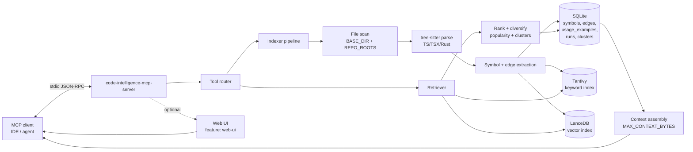

# code-intelligence-mcp-server

Local MCP server for code intelligence: symbol indexing (TS/TSX/Rust), hybrid retrieval (Tantivy + LanceDB), and a lightweight dependency graph.

## MCP server

This binary implements an MCP server over stdio. MCP clients (IDEs, assistants, agents) can call tools to:

- refresh the index (full or partial)
- search for relevant symbols and return an assembled context window
- retrieve definitions, references, call/type graphs, and usage examples

### Tools

- `search_code`: hybrid search and assembled context
- `refresh_index`: index all roots or specific files
- `get_definition`: exact-name definitions with optional file filter
- `find_references`: graph-backed references (calls/imports/uses)
- `get_file_symbols`: list symbol headers in a file
- `get_call_hierarchy`: callers/callees traversal
- `get_type_graph`: extends/implements/alias traversal
- `get_usage_examples`: extracted usage snippets
- `get_index_stats`: counts + latest index/search run metrics
- `get_similarity_cluster`: symbols in the same similarity cluster

## Architecture



### Data flow (high level)

- Indexing:
  - scans files under `BASE_DIR` and additional `REPO_ROOTS`
  - extracts symbols and graph edges, then persists to SQLite
  - updates Tantivy (keyword search) and LanceDB (vector search)
  - stores similarity cluster keys for diversification
- Search:
  - runs Tantivy + LanceDB retrieval
  - ranks + de-duplicates results, applies popularity and diversification
  - expands via graph edges and assembles a bounded context window

## Prerequisites

- Rust toolchain (stable) with Cargo
- A repo to index (set `BASE_DIR` to its absolute path)

Optional:

- A local embedding model directory (only if using `EMBEDDINGS_BACKEND=candle`)

## Development

### Fast iteration

```bash
export BASE_DIR="$PWD"
export EMBEDDINGS_BACKEND=hash
cargo run
```

### Format, test, lint

```bash
cargo fmt
cargo test
cargo clippy --all-targets -- -D warnings
```

## Configuration

Required:

- `BASE_DIR=/absolute/path/to/repo`

Common:

- `EMBEDDINGS_BACKEND=hash|candle` (default: `hash`, unless an embeddings model is detected)
- `EMBEDDINGS_MODEL_DIR=/absolute/path/to/model`
- `EMBEDDINGS_AUTO_DOWNLOAD=true|false` (default: `false`; requires build feature `model-download`)
- `EMBEDDINGS_MODEL_URL=https://...` (optional; tar.gz/tgz archive URL)
- `EMBEDDINGS_MODEL_SHA256=<hex>` (optional; verifies downloaded archive)
- `EMBEDDINGS_MODEL_REPO=org/repo` (default: `sentence-transformers/all-MiniLM-L6-v2`)
- `EMBEDDINGS_MODEL_REVISION=main` (default: `main`)
- `EMBEDDINGS_MODEL_HF_TOKEN=...` (optional; for gated Hugging Face models)
- `EMBEDDINGS_DEVICE=cpu|metal` (default: `cpu`)
- `EMBEDDING_BATCH_SIZE=32`
- `HASH_EMBEDDING_DIM=64`
- `VECTOR_SEARCH_LIMIT=20`
- `MAX_CONTEXT_BYTES=200000`
- `WATCH_MODE=true|false`
- `WATCH_DEBOUNCE_MS=250`
- `INDEX_NODE_MODULES=true|false`
- `REPO_ROOTS=/path/a,/path/b` (additional roots to index)

Storage locations (relative values are resolved under `BASE_DIR`):

- `DB_PATH=./.cimcp/code-intelligence.db`
- `VECTOR_DB_PATH=./.cimcp/vectors`
- `TANTIVY_INDEX_PATH=./.cimcp/tantivy-index`

Embeddings auto-detection (when `EMBEDDINGS_BACKEND` is not set):

- If `EMBEDDINGS_MODEL_DIR` is set, the server uses `candle`.
- Otherwise, if one of these directories exists under `BASE_DIR`, the server uses `candle`:
  - `./embeddings-model` (preferred)
  - `./.embeddings`
  - `./.cimcp/embeddings-model`
- If none exist, the server uses `hash`.

## Run (MCP stdio)

```bash
export BASE_DIR="$PWD"
export EMBEDDINGS_BACKEND=hash
cargo run --release
```

## Deployment (OpenCode / MCP clients)

This server speaks MCP over stdio, so the MCP client launches it as a subprocess and communicates via JSON-RPC over stdin/stdout.

1) Build (or install) the binary

```bash
cargo build --release
```

Binary path:

- `target/release/code-intelligence-mcp-server`

1) Pick persistent storage locations

By default, `DB_PATH`, `VECTOR_DB_PATH`, and `TANTIVY_INDEX_PATH` are created under `BASE_DIR`. For deployment, it’s often nicer to point them at a dedicated cache directory via absolute paths.

1) Configure OpenCode to launch the MCP server

Add an MCP server entry that points at the binary and passes env vars (OpenCode config format may vary, but most MCP clients use a `mcpServers` map like this):

```json
{
  "mcpServers": {
    "code-intelligence": {
      "command": "/absolute/path/to/target/release/code-intelligence-mcp-server",
      "args": [],
      "env": {
        "BASE_DIR": "/absolute/path/to/your/repo",
        "EMBEDDINGS_BACKEND": "hash",
        "DB_PATH": "/absolute/path/to/cache/code-intelligence.db",
        "VECTOR_DB_PATH": "/absolute/path/to/cache/vectors",
        "TANTIVY_INDEX_PATH": "/absolute/path/to/cache/tantivy-index"
      }
    }
  }
}
```

1) Start OpenCode and verify tool registration

You should see tools like `search_code` and `refresh_index` available for the `code-intelligence` server.

1) Run the initial index

- Call `refresh_index` once (no args) to index everything under `BASE_DIR` (and any `REPO_ROOTS`).
- Optionally set `WATCH_MODE=true` for continuous re-indexing.

1) Use it for context

Once indexed, OpenCode can call `search_code` to fetch an assembled context window for a query, and use `get_definition`, `find_references`, `get_call_hierarchy`, etc. as needed.

## Indexing

- Call `refresh_index` with no args to index everything under `BASE_DIR` (and any `REPO_ROOTS`).
- Use `WATCH_MODE=true` to continuously re-index.

## Multi-root indexing

Provide additional roots:

```bash
export REPO_ROOTS="/path/to/another/repo,/path/to/vendor"
```

## Optional web UI

Build with the `web-ui` feature and enable it via env:

```bash
export WEB_UI=true
export WEB_UI_ADDR="127.0.0.1:8787"
cargo run --release --features web-ui
```

Open: `http://127.0.0.1:8787/`

## Build

Release binary:

```bash
cargo build --release
```

With optional web UI:

```bash
cargo build --release --features web-ui
```

## Publish

### Publish a binary artifact (recommended)

- Build: `cargo build --release`
- The binary is at: `target/release/code-intelligence-mcp-server`
- Distribute it via your release process (e.g., GitHub Releases, internal artifact store).

### Publish to crates.io (optional)

This repo currently focuses on being an application (MCP server). If you want to publish to crates.io:

- Ensure package metadata is set in `Cargo.toml` (`description`, `repository`, and a `license` or `license-file`)
- Run:

```bash
cargo publish
```

### Install from git (optional)

```bash
cargo install --git <your_repo_url> --locked
```
