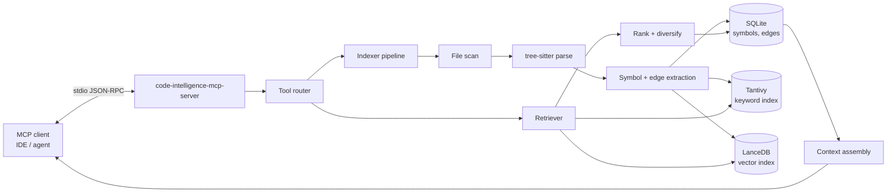

# Code Intelligence MCP Server

A powerful **Model Context Protocol (MCP)** server for intelligent code navigation and search.

This server provides advanced context to LLM agents (like OpenCode, Trae, Cursor, etc.) by indexing your codebase locally.

## Features

* **Hybrid Search**: Combines keyword search (Tantivy) with semantic vector search (LanceDB + FastEmbed).
* **Smart Embeddings**: Uses `BAAI/bge-base-en-v1.5` by default for high-quality semantic understanding.
* **Local & Fast**: Everything runs locally. Indexes are stored inside your project (`.cimcp/`).
* **Zero Config**: Works out of the box with `npx`. No Rust toolchain required for users.
* **Metal Acceleration**: Automatically uses Metal GPU acceleration on macOS for fast indexing.
* **Symbol Navigation**: Jump to definitions, find references, call hierarchies, and type graphs.

## Quick Start (OpenCode)

Add this to your project's `opencode.json` (or global config):

```json
{
  "mcp": {
    "code-intelligence": {
      "type": "local",
      "command": ["npx", "-y", "@iceinvein/code-intelligence-mcp"],
      "enabled": true
    }
  }
}
```

That's it! OpenCode will download the package, fetch the AI model (approx 300MB, once), index your code, and enable smart tools.

## Tools Provided

* `search_code`: Find code by semantic meaning or keywords.
* `get_definition`: Jump to symbol definitions.
* `find_references`: Find all usages of a symbol.
* `get_call_hierarchy`: See who calls a function or what it calls.
* `get_type_graph`: Explore type inheritance and implementation.
* `get_file_symbols`: List all symbols defined in a file.
* `get_usage_examples`: Get code examples of how a symbol is used.
* `get_index_stats`: View stats about the indexed codebase.
* `refresh_index`: Manually trigger a re-index (happens automatically on startup).

## Configuration (Optional)

You typically **do not** need to configure anything. The default wrapper script handles:

* `BASE_DIR`: Current working directory.
* `DB_PATH`, `VECTOR_DB_PATH`: Stored in `./.cimcp/`.
* `EMBEDDINGS_BACKEND`: `fastembed` (Local AI).
* `EMBEDDINGS_MODEL_REPO`: `BAAI/bge-base-en-v1.5`.

If you need to customize behavior, you can set environment variables in your MCP config:

```json
{
  "mcp": {
    "code-intelligence": {
      "type": "local",
      "command": ["npx", "-y", "@iceinvein/code-intelligence-mcp"],
      "env": {
         "EMBEDDINGS_DEVICE": "cpu", 
         "WATCH_MODE": "true"
      }
    }
  }
}
```

| Variable            | Default                         | Description                                 |
| :------------------ | :------------------------------ | :------------------------------------------ |
| `WATCH_MODE`        | `false`                         | Enable file watcher for real-time indexing. |
| `EMBEDDINGS_DEVICE` | `metal` (macOS), `cpu` (others) | Force CPU usage if needed.                  |
| `INDEX_PATTERNS`    | `**/*.ts,**/*.tsx,**/*.rs`      | CSV of glob patterns to index.              |
| `EXCLUDE_PATTERNS`  | `node_modules/**,...`           | CSV of glob patterns to ignore.             |

## Development

If you want to contribute to the Rust server source code:

### Prerequisites

* Rust (stable)
* `protobuf` (`brew install protobuf` on macOS)

### Build

```bash
# Build with all features
cargo build --release
```

### Release Process

1. Run `./scripts/release.sh <version>` (e.g. `0.1.4`)
2. Push tags to GitHub (`git push origin main --tags`)
3. Wait for GitHub Actions to build binaries.
4. Publish to NPM (`cd npm && npm publish`).

## Architecture


