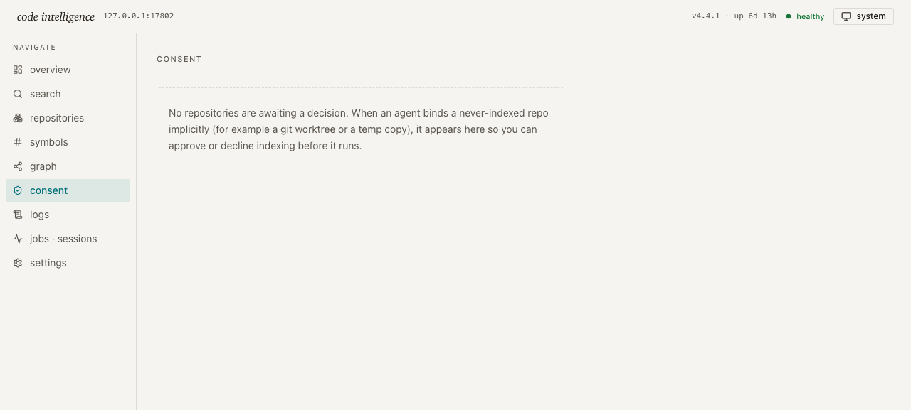

# Code Intelligence MCP Server

> **Give your AI coding agent a deep understanding of your codebase.**

[](https://www.npmjs.com/package/@iceinvein/code-intelligence-mcp)
[](LICENSE)
[](https://modelcontextprotocol.io)
[-lightgrey?style=flat-square)]()

A local code indexing engine that gives LLM agents like **Claude Code**, **Cursor**, **Trae**, and **OpenCode** semantic search, call graphs, type hierarchies, and impact analysis across your codebase. Written in Rust with Metal GPU acceleration.

MCP is the current integration surface, but the durable product boundary is the local code intelligence engine. The next interface layer is a first-class CLI plus stable JSON contracts over the same daemon APIs; see [Interface Direction](docs/architecture/interface-direction.md).

**Zero config. Runs via `npx`. Indexes in the background.**

---

## Install

> **v4.0 is a breaking change.** The server now runs as a single shared HTTP daemon instead of an stdio process spawned per MCP client. Existing v3 configs (`command: npx ...`) need to migrate. The binary ships a `migrate` subcommand that rewrites your `~/.claude.json` in place.

### Quickstart

**Homebrew (recommended on macOS):**

```bash
brew tap iceinvein/tap
brew install code-intelligence-mcp
brew services start code-intelligence-mcp

# Migrate existing ~/.claude.json entries (one-time, optional)
code-intelligence-mcp-server migrate
```

**npm (or `npx`, if you prefer):**

```bash
# Install the binary, write the launchd plist, bootstrap the daemon
npx -y @iceinvein/code-intelligence-mcp install

# Migrate existing ~/.claude.json entries (or use `--dry-run` to preview)
npx -y @iceinvein/code-intelligence-mcp migrate
```

Both paths produce the same daemon listening on `http://127.0.0.1:17800/mcp`. Pass `--port` to override.

> **Don't mix paths.** Homebrew manages launchd via `brew services`; the binary's own `install` subcommand writes a separate `com.iceinvein.code-intelligence.plist`. Pick one. The Homebrew path is the long-term home for v4+. The npm path stays supported for users already wired to `npx ...` from v3.

### Binding a workspace per client

Every session needs a bound workspace. v4 tries four sources in order; first match wins.

1. **`?repo=/abs/path` URL query** — *primary, works on every MCP client.* The daemon's proxy captures the query, pairs it with the session id, and binds before the first tool call.
2. **MCP `roots/list`** — Claude Code negotiates this automatically.
3. **Single-repo fallback** — when only one repo is registered, sessions auto-bind to it.
4. **Hard error** — actionable message pointing at the URL form and `bind_workspace`.

When a session selects a **never-indexed** repo through any binding source, including `?repo=` and `bind_workspace`, the daemon returns `consent_required` so the agent can ask you first. Approval starts the first full index immediately as a background job. A worktree whose base repo already has a completed index is the exception: it seeds from that index and starts indexing without a prompt. See [Indexing consent](#indexing-consent).

**Claude Code**: nothing extra; roots is auto-negotiated.

**Every other client (Cursor, OpenCode, Codex, Continue, Windsurf, Trae)**: add `?repo=...` to the URL. Example for OpenCode:

```json
{
  "mcp": {
    "code-intelligence": {
      "type": "remote",
      "url": "http://127.0.0.1:17800/mcp?repo=/Users/me/projects/my-app",
      "enabled": true
    }
  }
}
```

Multiple workspaces in one client: define one MCP server entry per workspace, each with its own `?repo=` value. The daemon multiplexes them onto the same backend.

For full per-client recipes (including the manual `bind_workspace` fallback), see [docs/MIGRATION-v3-to-v4.md](docs/MIGRATION-v3-to-v4.md).

### Lifecycle commands

```bash
code-intelligence-mcp-server install      # one-time setup
code-intelligence-mcp-server status       # daemon state, PID, port
code-intelligence-mcp-server start        # kickstart
code-intelligence-mcp-server stop         # bootout
code-intelligence-mcp-server uninstall    # remove plist + bootout
code-intelligence-mcp-server migrate      # rewrite v3 stdio configs
```

### Agent query CLI

The binary also exposes the first agent-query commands over the shared daemon API:

```bash
code-intelligence-mcp-server ask --repo . --json "how does auth work?"
code-intelligence-mcp-server search --repo . --context snippets --json "auth handler"
code-intelligence-mcp-server investigate --repo . --mode impact --target authenticate_request --json "what breaks if this changes?"
code-intelligence-mcp-server hydrate --repo . --ids sym_1,sym_2 --json
code-intelligence-mcp-server repo-map --repo . --budget 4000 --json
```

The CLI calls the loopback dashboard/API port (`mcp_port + 2`, default `17802`) and returns the same structured evidence contracts used by MCP handlers. The daemon must already be running. Use `--port` when targeting a daemon on a non-default MCP port.

Agent-query commands support `--timeout`, `--no-start`, stable JSON failure envelopes, and distinct exit codes for invalid arguments, daemon unavailable, workspace unavailable, no results, timeout, and internal errors. See [Agent Query CLI](docs/agent-query-cli.md).

Framework routes are surfaced as first-class context where available: `repo-map` includes per-file `routes` with handler links, and impact/investigation results annotate matching symbols with `route_exposure`.

### Agent installer

Use `install-agent` to add a managed Code Intelligence instruction block to agent-facing project files and print the MCP config snippet for the local daemon:

```bash
code-intelligence-mcp-server install-agent --repo . --target codex
code-intelligence-mcp-server install-agent --repo . --target claude,cursor --dry-run
code-intelligence-mcp-server install-agent --target all --print-config
code-intelligence-mcp-server uninstall-agent --repo . --target all
```

Project-scope targets write only a marked block that can be safely replaced or removed later: `AGENTS.md` for Codex/generic/OpenCode, `CLAUDE.md` for Claude, and `.cursor/rules/code-intelligence.mdc` for Cursor. User-scope config is intentionally conservative; `--scope user --target claude --no-instructions` patches `~/.claude.json` through the same HTTP MCP entry used by the daemon installer. See [Agent Installer](docs/agent-installer.md).

> First-time `install` downloads one model by default: the embedding model (Jina Code 1.5b, ~1.5 GB). Two more are off by default and download only when opted into: the description LLM (Qwen2.5-Coder-1.5B, ~1.0 GB) when `DESCRIPTIONS_ENABLED=1`, and the cross-encoder reranker (bge-reranker-v2-m3, ~600 MB) when `RERANKER_ENABLED=1`. Indexing then runs in the background. Models cache in `~/.code-intelligence/models/`. macOS 13+ required for the modern `launchctl bootstrap` API.

### Bundled External Producers

Code Intelligence installs external producer entrypoints with the server binary. TypeScript/JavaScript, Rust, Python, and Go have integrated, deterministically tested generators. Java, Kotlin, C#, Swift, C, C++, and Ruby expose adapter contracts only: supply a generator with `EXTERNAL_INDEX_<LANG>_COMMAND` that writes the normalized artifact. The dashboard/API reports these states as `integrated`, `adapter_only`, or `missing` instead of treating a diagnostic wrapper as a working generator.

Commands are resolved from an explicit `EXTERNAL_INDEX_<LANG>_COMMAND` override first, then from the installed binary directory and `PATH`. Invoking an adapter-only bundled entrypoint returns `adapter_required` without starting a placeholder process.

Bundled producers do not make external indexing automatic. The default remains native Tree-sitter indexing:

```bash
EXTERNAL_INDEX_AUTO=false
EXTERNAL_INDEX_ON_REFRESH=disabled
```

Use `generate_external_index` or opt-in refresh configuration to run producers before benchmark-proven defaults are enabled.

### Dashboard


Open `http://127.0.0.1:17802/` once the daemon is up. The dashboard is a single-page app with a sidebar of views and a system / light / dark theme toggle in the header:

- **Overview**: daemon status, stat cards (repositories, sessions, jobs), the repo list, and recent indexing jobs.
- **Search**: an interactive hybrid-search playground; pick any indexed repo and run a query straight from the browser.
- **Repositories**: every registered repo with per-repo stats (symbols, edges, descriptions, coverage %, latest run timings), inline re-index / delete, and an Add Repo flow.
- **Symbols**: browse the indexed symbols for a repo.
- **Graph**: interactive call hierarchy, type, and dependency graph visualization.
- **Consent**: approve or decline the first full index for newly selected repos (see [Indexing consent](#indexing-consent)).
- **Logs**: live tail over SSE with pause / clear and level filtering.
- **Jobs · sessions**: background indexing jobs and connected vs bound MCP sessions (dead sessions evict themselves after a five-minute inactivity TTL).
- **Settings**: read and write the `server.toml` tuning knobs without restarting the editor.

The dashboard, the JSON API at `/api/*`, and the discovery endpoint all bind 127.0.0.1 only and enforce same-origin checks so a malicious web page cannot reach the daemon via DNS rebinding.

### Indexing consent

Indexing a repo uses local compute, memory, and disk. With `INDEX_CONSENT_REQUIRED=true`, every repository that has never completed a full index returns `consent_required`, including repositories selected through `?repo=` or `bind_workspace`:

```json
{
  "status": "consent_required",
  "repo": "/Users/me/project/.worktrees/feature",
  "detected": "git_worktree",
  "recommendation": "Looks like a git worktree of /Users/me/project (usually ephemeral). Indexing runs a full GPU embedding pass and starts a file watcher. Most worktrees should be skipped.",
  "action": "Tell the user in chat that this repository needs its first full index and that indexing uses local compute, memory, and disk. Ask for permission and wait for explicit approval. Only then call approve_indexing with decision \"approve\". If the user declines, call it with decision \"decline\"."
}
```

The one exception is a worktree whose base repo already has a completed index, unlike the worktree in the example above: it seeds from that index and starts indexing immediately, without this prompt.

The agent relays the question and waits for explicit approval before calling `approve_indexing`. `approve` persists the one-time authorization and starts a background `InitialBind` job immediately; `decline` records the choice and skips indexing. The watcher starts only after the native full index succeeds. Later watcher updates and manual reindexes do not ask again, including after a daemon restart or a failed first attempt. `INDEX_CONSENT_REQUIRED=false` keeps the CI and benchmark opt-out, but still starts the real first-index job immediately rather than waiting for a file event.



The dashboard's **Consent** tab lists repos awaiting a decision (and any you previously declined) with inline approve / decline buttons, mirroring the `GET` / `POST /api/consent` endpoint.

### JSON API

For scripting outside the dashboard, every UI surface has a structured endpoint at port `mcp_port + 2` (default 17802):

| Method | Path | Returns |
|---|---|---|
| `GET` | `/api/version` | daemon version, uptime |
| `GET` | `/api/status` | daemon overview |
| `GET` | `/api/repos` | registered repos |
| `GET` | `/api/repos/:id` | per-repo metadata + stats |
| `POST` | `/api/repos/:id/reindex` | spawn a background re-index, returns `job_id` |
| `DELETE` | `/api/repos/:id` | drop the index, registry entry, and data dir |
| `GET` | `/api/sessions` | bound + connected MCP sessions |
| `GET` | `/api/jobs` | running + recent (≤15 min) jobs |
| `GET` | `/api/consent` | repos awaiting an indexing decision (+ previously declined) |
| `POST` | `/api/consent` | approve or decline indexing for a repo |
| `GET` | `/api/logs/stream` | SSE stream of log lines |
| `POST` | `/api/query/ask` | CLI-facing `ask_code` wrapper with structured envelope |
| `POST` | `/api/query/search` | CLI-facing `search_code` wrapper with structured envelope |
| `POST` | `/api/query/investigate` | CLI-facing `investigate` wrapper with structured envelope |
| `POST` | `/api/query/hydrate` | CLI-facing `hydrate_symbols` wrapper with structured envelope |
| `POST` | `/api/query/repo-map` | CLI-facing compact project map with structured envelope |

---

## What It Does

Unlike basic text search (grep/ripgrep), this server builds a **local knowledge graph** of your code and exposes it through 18 MCP tools.

| Capability | How It Works |
|---|---|
| **Hybrid search** | BM25 keyword search (Tantivy) + semantic vector search (LanceDB, jina-code-embeddings-1.5b, 1536-dim Matryoshka) merged via Reciprocal Rank Fusion |
| **Cross-encoder reranking** _(opt-in)_ | bge-reranker-v2-m3 re-scores top candidates (llama.cpp + Metal). Off by default (`RERANKER_ENABLED=1` to enable) — benchmarks showed it net-negative on answer quality |
| **On-device LLM descriptions** _(opt-in)_ | Qwen2.5-Coder-1.5B generates natural-language summaries per symbol, bridging the gap between how you search ("auth handler") and how code is named (`authenticate_request`). Off by default (`DESCRIPTIONS_ENABLED=1`) — a multi-hour index-time backfill with no measured judge benefit |
| **Graph intelligence** | Call hierarchies, type graphs, dependency trees, and PageRank-based importance scoring |
| **Impact analysis** | Find all code affected by a change, with optional git co-change history for confidence scoring |
| **Smart ranking** | Test detection, export boosting, directory semantics, intent detection, edge expansion, framework-pattern injection, score-gap filtering, sub-query coverage |
| **Multi-repo** | Index and search across multiple repositories simultaneously, including cross-repo dependency exploration |
| **Auto-reindex** | OS-native file watching (FSEvents) keeps the index fresh as you code |

---

## Tools (18)

> **Upgrade note (3.0.0):** `search_code` no longer assembles a `context` markdown bundle by default. Pass `context: "snippets"` for compact per-hit code, or `context: "full"` to restore the v2 behavior. See [Migration](#migration-v2--v3) below.

### Investigation (start here)

| Tool | What It Does |
|---|---|
| `ask_code` | Single-call entry point for any code question. Runs the full `investigate` chain server-side and returns verified evidence (symbol, file, line range, body) plus a shape classification for you to synthesize the answer from. |
| `investigate` | Composite multi-hop retrieval. Picks the right specialist chain (search → call hierarchy / data flow / impact / dependencies) by question shape and returns bundled evidence with verified locations. |

### Search & Navigation

| Tool | What It Does |
|---|---|
| `search_code` | Semantic + keyword hybrid search. Handles natural language ("how does auth work?") and structural queries ("class User"). Pass `context: "snippets"` or `"full"` to receive source code alongside hits. |
| `get_definition` | Jump to a symbol's full definition |
| `find_references` | Find all usages of a function, class, or variable |
| `get_call_hierarchy` | Upstream callers and downstream callees |
| `get_type_graph` | Inheritance chains, type aliases, implements relationships |
| `explore_dependency_graph` | Module-level import/export dependencies |

### Analysis

| Tool | What It Does |
|---|---|
| `find_affected_code` | Reverse dependency analysis: what breaks if this changes? |
| `trace_data_flow` | Follow variable reads and writes through the code |
| `summarize_file` | File summary with symbol counts and key exports |
| `get_module_summary` | All exported symbols from a module with signatures |

### Testing & Discovery

| Tool | What It Does |
|---|---|
| `find_tests_for_symbol` | Find tests that cover a given symbol |

### Index Management

| Tool | What It Does |
|---|---|
| `hydrate_symbols` | Load full context for a set of symbol IDs |
| `refresh_index` | Manually trigger re-indexing |
| `get_index_stats` | Index statistics (files, symbols, edges, last updated) |

### Session & Consent

| Tool | What It Does |
|---|---|
| `bind_workspace` | Bind the session to a workspace root by absolute path (the manual fallback for clients that can't set `?repo=`) |
| `approve_indexing` | Approve or decline a repository's first full index after `consent_required` (see [Indexing consent](#indexing-consent)) |

> A few operational tools remain callable by name but are intentionally not advertised to keep the model's tool list focused: `get_file_symbols`, `get_usage_examples`, `explain_search`, `import_external_index`, `generate_external_index`, `report_selection`, `report_file_access`.

---

## Supported Languages

Rust, TypeScript (`.ts` / `.tsx`), JavaScript (`.js` / `.jsx`), Python, Go, Java, C, C++, Ruby, Kotlin, C#, Swift.

Framework patterns are extracted for Express, Hono, Fastify, Elysia, FastAPI, Django, Spring, Actix, Axum, NestJS, NextJS, tRPC, Convex, and several Go / Ruby / Kotlin / Swift web stacks.

---

## Architecture

Since v4.0, the server runs as a single HTTP daemon managed by launchd. Every MCP client connects to the same daemon over Streamable HTTP. Models load once and are shared. Per-repo indexes live under `~/.code-intelligence/repos/<hash>/`.

```
                      ┌──────────┐  ┌──────────┐  ┌──────────┐
                      │ Claude A │  │ Cursor B │  │  Trae C  │
                      └─────┬────┘  └─────┬────┘  └─────┬────┘
                            │             │             │
                            │ POST /mcp?repo=/abs/path  │
                            └────────────┬──────────────┘
                                         │
   public port 17800       ┌─────────────┴──────────────┐
   (MCP proxy + dashboard) │  axum proxy reads ?repo=,  │
                           │  forwards to SDK on 17900, │
                           │  pairs session_id ⇄ repo   │
                           └─────────────┬──────────────┘
                                         │
   internal port 17900     ┌─────────────┴──────────────┐
   (rust-mcp-sdk transport)│  StandaloneHandler routes  │
                           │  each session to per-repo  │
                           │  AppState (lazy init)      │
                           └─────────────┬──────────────┘
                                         │
                           ┌─────────────┴──────────────┐
                           │ Repo A  Repo B  Repo C ... │
                           │ index   index   index      │
                           └────────────────────────────┘
```

Sessions bind to a repo through one of four mechanisms, tried in order; first match wins:

1. **`?repo=/abs/path` URL query** — primary. The proxy captures the query, pairs it with the SDK-assigned `mcp-session-id`, and binds before the first tool call.
2. **MCP `roots/list`** — Claude Code negotiates this automatically. Opportunistic upgrade if no URL was provided.
3. **`bind_workspace` tool call** — manual escape hatch for clients that can't set query strings.
4. **Single-repo registry fallback** — when the registry has exactly one repo, sessions auto-bind to it.

Beyond the MCP transport, the daemon exposes a discovery endpoint at `mcp_port + 1` and a JSON API + embedded dashboard at `mcp_port + 2`. All three bind 127.0.0.1 only.

### Session resilience (v4.0.1+)

When the upstream rust-mcp-sdk times out a session and returns the `-32016` session-expired envelope, the proxy transparently re-initialises the session, replays the original request with the new session id, and forwards the second response to the client. Workspace bindings (`?repo=`, `roots/list`, `bind_workspace`) survive the recovery, and concurrent retries for the same stale session id are deduplicated so racing in-flight requests do not cause re-init storms. Successful recoveries are logged at INFO; you can see them in the dashboard's log panel.

---

## Configuration

Works out of the box with no configuration. All settings are optional environment variables.

<details>
<summary><strong>Environment variables</strong></summary>

**Core:**

| Variable | Default | Description |
|---|---|---|
| `WATCH_MODE` | `true` | Auto-reindex on file changes |
| `INDEX_PATTERNS` | `**/*.ts,**/*.rs,...` | Glob patterns to index |
| `EXCLUDE_PATTERNS` | `**/node_modules/**,...` | Glob patterns to exclude |
| `REPO_ROOTS` | — | Comma-separated paths for multi-repo |
| `INDEX_CONSENT_REQUIRED` | `true` | Ask once before the first full index for every binding source (see [Indexing consent](#indexing-consent)). A worktree of an already-indexed repo seeds instead and is never prompted. `false` skips the prompt but still starts the first index immediately |

**Embeddings:**

| Variable | Default | Description |
|---|---|---|
| `EMBEDDINGS_BACKEND` | `llamacpp` | `llamacpp` or `hash` (fast testing, no model download) |
| `EMBEDDINGS_DEVICE` | `metal` | `metal` (GPU) or `cpu` |

**Ranking:**

| Variable | Default | Description |
|---|---|---|
| `HYBRID_ALPHA` | `0.7` | Vector vs keyword weight (0 = all keyword, 1 = all vector) |
| `RANK_EXPORTED_BOOST` | `1.0` | Boost for exported/public symbols |
| `RANK_TEST_PENALTY` | `0.1` | Penalty multiplier for test files |
| `RANK_POPULARITY_WEIGHT` | `0.05` | PageRank influence on ranking |

**Context:**

| Variable | Default | Description |
|---|---|---|
| `MAX_CONTEXT_TOKENS` | `8192` | Token budget for assembled context |
| `MAX_CONTEXT_BYTES` | `200000` | Byte-based fallback limit |

**Investigation diagnostics:**

| Variable | Default | Description |
|---|---|---|
| `INVESTIGATION_DISABLED_PASSES` | — | Comma-separated typed enrichment pass IDs to disable for isolation: `supporting_definition`, `question_route`, `evidence_route`, `sibling_route`, `handler_dependency`, `module_breadth`, `breadth_dependency`, or `hub_type` |
| `INVESTIGATION_TRACE` | `false` | Include pass applicability, cost, timing, provenance, and per-candidate allocation decisions in `investigate` output |

**Learning (on by default):**

| Variable | Default | Description |
|---|---|---|
| `LEARNING_ENABLED` | `true` | Track user selections and file access to personalize results |
| `LEARNING_SELECTION_BOOST` | `0.1` | Max boost from selection history |
| `LEARNING_FILE_AFFINITY_BOOST` | `0.05` | Max boost from file access frequency |

</details>

<details>
<summary><strong>Standalone server config (<code>~/.code-intelligence/server.toml</code>)</strong></summary>

```toml
[server]
host = "127.0.0.1"
port = 17800

[embeddings]
backend = "llamacpp"
device = "metal"

[repos.defaults]
index_patterns = "**/*.ts,**/*.tsx,**/*.rs,**/*.py,**/*.go"
exclude_patterns = "**/node_modules/**,**/dist/**,**/.git/**"
watch_mode = true

[lifecycle]
warm_ttl_seconds = 300      # How long idle repos stay in memory
```

Priority: CLI flags > Environment variables > `server.toml` > Defaults

</details>

---

## How Ranking Works

The search pipeline runs keyword search (BM25) and semantic vector search in parallel, merges them with Reciprocal Rank Fusion, then applies structural signals:

- **Intent detection** — "struct User" boosts definitions, "who calls login" triggers graph lookup, "User schema" boosts models 50-75x
- **Query decomposition** — "authentication and authorization" automatically splits into sub-queries; sub-query coverage ensures each term has at least one matching result
- **LLM-enriched index** _(opt-in)_ — on-device Qwen2.5-Coder generates descriptions bridging vocabulary gaps between how you search and how code is named. Off by default (`DESCRIPTIONS_ENABLED=1`); no measured judge benefit and a multi-hour index-time backfill
- **Cross-encoder reranker** _(opt-in)_ — bge-reranker-v2-m3 re-scores top candidates for precision. Off by default (`RERANKER_ENABLED=1`); benchmarks (R006) showed it net-negative on answer quality
- **PageRank** — graph-based importance scoring identifies central, heavily-used symbols
- **Morphological expansion** — `watch` matches `watcher`, `index` matches `reindex`
- **Framework-pattern injection** — route, middleware, and handler patterns surface alongside symbol matches
- **Multi-layer test detection** — file paths, symbol names, and AST-level analysis (`#[test]`, `mod tests`)
- **Edge expansion** — high-ranking symbols pull in structurally related code (callers, type members)
- **Export boost** — public API surface ranks above private helpers
- **Score-gap detection** — drops trailing results that fall off a relevance cliff
- **Token-aware truncation** — context assembly keeps query-relevant lines within token budgets

For the full deep dive, see [System Architecture](SYSTEM_ARCHITECTURE.md).

---

## Data Storage

All data lives in `~/.code-intelligence/`:

```
~/.code-intelligence/
├── models/                     # Shared across repos (~1.5 GB default; ~3.2 GB if both opt-ins enabled)
│   ├── jina-code-embeddings-1.5b-gguf/   # ~1.5 GB, 1536-dim Matryoshka, Q8_0 (default)
│   ├── qwen2.5-coder-1.5b-gguf/          # ~1.0 GB, Q4_K_M, description LLM (only if DESCRIPTIONS_ENABLED=1)
│   └── bge-reranker-v2-m3-gguf/          # ~600 MB, Q8_0, cross-encoder reranker (only if RERANKER_ENABLED=1)
├── repos/
│   ├── registry.json           # Tracks all known repos
│   └── <hash>/                 # Per-repo (SHA256 of repo path)
│       ├── code-intelligence.db   # SQLite (symbols, edges, metadata, descriptions)
│       ├── tantivy-index/         # BM25 full-text search
│       └── vectors/               # LanceDB vector embeddings
├── logs/
└── server.toml                 # Standalone config (optional)
```

---

## Development

Production builds require the Xcode command-line tools and CMake
(`brew install cmake`). Cargo automatically uses the repository's pinned,
checksummed `protoc` bootstrap; no system protobuf installation is required.

```bash
cargo build --release
cargo test                                        # Full test suite
EMBEDDINGS_BACKEND=hash cargo test --no-default-features  # Fast; no llama.cpp/CMake/model
./scripts/start_mcp.sh                            # Start MCP server
```

The default `native-llama` feature builds the Metal-backed embeddings, optional
description LLM, and reranker used by production. `EMBEDDINGS_BACKEND=hash` is
the runtime selection; add `--no-default-features` when a deterministic test
build should omit the native llama.cpp dependency entirely.

<details>
<summary>Project structure</summary>

```
src/
├── indexer/          # File scanning, Tree-Sitter parsing, symbol extraction, embeddings, LLM descriptions
├── storage/          # SQLite, Tantivy (BM25), LanceDB (vectors)
├── retrieval/        # Hybrid search, ranking signals, RRF, context assembly, reranker, HyDE
├── graph/            # PageRank, call hierarchy, type graphs, dependency graph
├── handlers/         # MCP tool implementations
├── server/           # MCP protocol routing (embedded + standalone)
├── tools/            # Tool definitions (18 advertised MCP tools)
├── cli.rs            # Daemon lifecycle and agent-query CLI
├── embeddings/       # jina-code-embeddings-1.5b (GGUF via llama.cpp + Metal)
├── llm/              # Qwen2.5-Coder-1.5B (GGUF via llama.cpp + Metal)
├── reranker/         # bge-reranker-v2-m3 cross-encoder (GGUF via llama.cpp + Metal)
└── path/             # UTF-8 path normalization (camino)
```
</details>

---

## Migration: v3 → v4

v4.0 is a hard pivot from stdio-per-client to a single shared HTTP daemon. The TL;DR:

```bash
npx -y @iceinvein/code-intelligence-mcp install    # writes plist + bootstraps daemon
npx -y @iceinvein/code-intelligence-mcp migrate    # rewrites ~/.claude.json
```

For per-client recipes (Cursor, OpenCode, Codex, Continue, Windsurf, Trae), the new `?repo=` URL pattern, common breakage points, and a rollback procedure, see [docs/MIGRATION-v3-to-v4.md](docs/MIGRATION-v3-to-v4.md).

## Migration: v2 → v3

`search_code` previously returned both ranked `hits` and a `context` markdown bundle (source code for top hits + auto-expanded "Examples" / "Related" symbols). The bundle was always assembled, even when callers only needed the ranked list, and could exceed 30 KB per call.

In **v3.0.0**, `search_code` is a discovery tool by default. It returns hits only. Source code is opt-in via the new `context` parameter:

| `context` value | What you get | Typical size (limit=5) |
|---|---|---|
| `"none"` *(default)* | `hits` array only — no source code, no graph expansion | ~600 B |
| `"snippets"` | `hits` with a `snippet` field on each (signature + first 8 body lines) | ~2-4 KB |
| `"full"` | Legacy v2 behavior: `context` markdown bundle with graph expansion | ~15 KB |

**To restore v2 behavior**, pass `context: "full"` on every call.

For most agent workflows, `"snippets"` is the recommended setting: enough code to ground the next decision, without rendering an entire markdown bundle. Agents that need full source for selected hits should call `hydrate_symbols(ids[])` after `search_code`.

The web UI and cross-repo aggregator continue to request `context: "full"` internally; only the public MCP `search_code` tool default has changed.

## License

MIT
