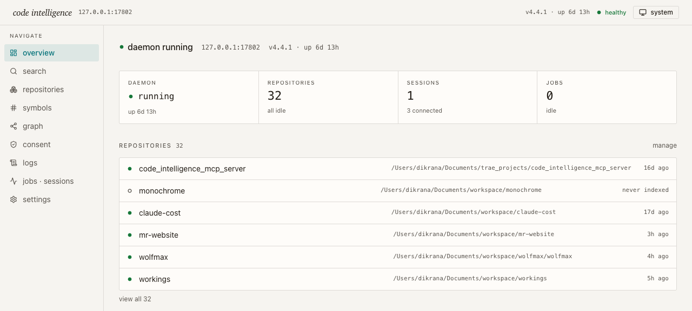

# Code Intelligence MCP Server

> **Give your AI coding agent a deep understanding of your codebase.**

[](https://www.npmjs.com/package/@iceinvein/code-intelligence-mcp)
[](LICENSE)
[](https://modelcontextprotocol.io)
[-lightgrey?style=flat-square)]()

A local code indexing engine that gives LLM agents like **Claude Code**, **Cursor**, **Trae**, and **OpenCode** semantic search, call graphs, type hierarchies, and impact analysis across your codebase. Written in Rust with Metal GPU acceleration.

**Zero config. Runs via `npx`. Indexes in the background.**

---

## Install

> **v4.0 is a breaking change.** The server now runs as a single shared HTTP daemon instead of an stdio process spawned per MCP client. Existing v3 configs (`command: npx ...`) need to migrate. The binary ships a `migrate` subcommand that rewrites your `~/.claude.json` in place.

### Quickstart (all clients)

```bash
# Install the binary, write the launchd plist, bootstrap the daemon
npx -y @iceinvein/code-intelligence-mcp install

# Migrate existing ~/.claude.json entries (or use `--dry-run` to preview)
npx -y @iceinvein/code-intelligence-mcp migrate
```

The daemon binds `http://127.0.0.1:17800/mcp` by default. Pass `--port` to override. The `install` subcommand prompts before patching `~/.claude.json`; pass `--patch-claude-json` to skip the prompt and patch automatically, or `--no-patch-claude-json` to leave it alone.

### Binding a workspace per client

Every session needs a bound workspace. v4 tries four sources in order; first match wins.

1. **`?repo=/abs/path` URL query** — *primary, works on every MCP client.* The daemon's proxy captures the query, pairs it with the session id, and binds before the first tool call.
2. **MCP `roots/list`** — Claude Code negotiates this automatically.
3. **Single-repo fallback** — when only one repo is registered, sessions auto-bind to it.
4. **Hard error** — actionable message pointing at the URL form and `bind_workspace`.

**Claude Code**: nothing extra; roots is auto-negotiated.

**Every other client (Cursor, OpenCode, Codex, Continue, Windsurf, Trae)**: add `?repo=...` to the URL. Example for OpenCode:

```json
{
  "mcp": {
    "code-intelligence": {
      "type": "remote",
      "url": "http://127.0.0.1:17800/mcp?repo=/Users/me/projects/my-app",
      "enabled": true
    }
  }
}
```

Multiple workspaces in one client: define one MCP server entry per workspace, each with its own `?repo=` value. The daemon multiplexes them onto the same backend.

For full per-client recipes (including the manual `bind_workspace` fallback), see [docs/MIGRATION-v3-to-v4.md](docs/MIGRATION-v3-to-v4.md).

### Lifecycle commands

```bash
code-intelligence-mcp-server install      # one-time setup
code-intelligence-mcp-server status       # daemon state, PID, port
code-intelligence-mcp-server start        # kickstart
code-intelligence-mcp-server stop         # bootout
code-intelligence-mcp-server uninstall    # remove plist + bootout
code-intelligence-mcp-server migrate      # rewrite v3 stdio configs
```

> First-time `install` downloads three models (~3.2 GB total): the embedding model (Jina Code 1.5b, ~1.5 GB), the description LLM (Qwen2.5-Coder-1.5B, ~1.0 GB), and the cross-encoder reranker (bge-reranker-v2-m3, ~600 MB). Indexing then runs in the background. Models cache in `~/.code-intelligence/models/`. macOS 13+ required for the modern `launchctl bootstrap` API.

### Dashboard



Open `http://127.0.0.1:17802/` once the daemon is up. The dashboard shows:

- **Repositories**: every registered repo, sortable by last-accessed. Click the row to expand per-repo stats (symbols, edges, descriptions, coverage %, latest run timings). Re-index and Delete actions inline.
- **MCP sessions**: connected vs bound count, with a five-minute inactivity TTL so dead sessions evict themselves.
- **Jobs**: in-flight and recently finished background indexing jobs with status badge, live elapsed, files/symbols summary on success, error message on failure.
- **Logs**: live tail over SSE with pause/clear and level filtering.
- **Theme**: system / light / dark toggle in the header.

The dashboard, the JSON API at `/api/*`, and the discovery endpoint all bind 127.0.0.1 only and enforce same-origin checks so a malicious web page cannot reach the daemon via DNS rebinding.

### JSON API

For scripting outside the dashboard, every UI surface has a structured endpoint at port `mcp_port + 2` (default 17802):

| Method | Path | Returns |
|---|---|---|
| `GET` | `/api/version` | daemon version, uptime |
| `GET` | `/api/status` | daemon overview |
| `GET` | `/api/repos` | registered repos |
| `GET` | `/api/repos/:id` | per-repo metadata + stats |
| `POST` | `/api/repos/:id/reindex` | spawn a background re-index, returns `job_id` |
| `DELETE` | `/api/repos/:id` | drop the index, registry entry, and data dir |
| `GET` | `/api/sessions` | bound + connected MCP sessions |
| `GET` | `/api/jobs` | running + recent (≤15 min) jobs |
| `GET` | `/api/logs/stream` | SSE stream of log lines |

---

## What It Does

Unlike basic text search (grep/ripgrep), this server builds a **local knowledge graph** of your code and exposes it through 32 MCP tools.

| Capability | How It Works |
|---|---|
| **Hybrid search** | BM25 keyword search (Tantivy) + semantic vector search (LanceDB, jina-code-embeddings-1.5b, 1536-dim Matryoshka) merged via Reciprocal Rank Fusion |
| **Cross-encoder reranking** | bge-reranker-v2-m3 re-scores top candidates (llama.cpp + Metal) for precision tuning |
| **On-device LLM descriptions** | Qwen2.5-Coder-1.5B generates natural-language summaries for every symbol, bridging the gap between how you search ("auth handler") and how code is named (`authenticate_request`) |
| **Graph intelligence** | Call hierarchies, type graphs, dependency trees, and PageRank-based importance scoring |
| **Impact analysis** | Find all code affected by a change, with optional git co-change history for confidence scoring |
| **Smart ranking** | Test detection, export boosting, directory semantics, intent detection, edge expansion, framework-pattern injection, score-gap filtering, sub-query coverage |
| **Multi-repo** | Index and search across multiple repositories simultaneously, including cross-repo dependency exploration |
| **Auto-reindex** | OS-native file watching (FSEvents) keeps the index fresh as you code |

---

## Tools (32)

> **Upgrade note (3.0.0):** `search_code` no longer assembles a `context` markdown bundle by default. Pass `context: "snippets"` for compact per-hit code, or `context: "full"` to restore the v2 behavior. See [Migration](#migration-v2--v3) below.

### Search & Navigation

| Tool | What It Does |
|---|---|
| `search_code` | Semantic + keyword hybrid search. Handles natural language ("how does auth work?") and structural queries ("class User"). Pass `context: "snippets"` or `"full"` to receive source code alongside hits. |
| `get_definition` | Jump to a symbol's full definition |
| `find_references` | Find all usages of a function, class, or variable |
| `get_call_hierarchy` | Upstream callers and downstream callees |
| `get_type_graph` | Inheritance chains, type aliases, implements relationships |
| `explore_dependency_graph` | Module-level import/export dependencies |
| `get_file_symbols` | All symbols defined in a file |
| `get_usage_examples` | Real-world usage examples from the codebase |
| `get_context_bundle` | Pre-assembled context bundle (definitions, call chains, tests, similar code) for a task description, in one call |

### Analysis

| Tool | What It Does |
|---|---|
| `find_affected_code` | Reverse dependency analysis — what breaks if this changes? |
| `predict_impact` | Like `find_affected_code` but also factors in git co-change history for confidence scoring |
| `trace_data_flow` | Follow variable reads and writes through the code |
| `find_similar_code` | Semantically similar code to a given symbol |
| `get_similarity_cluster` | Symbols in the same semantic cluster |
| `find_duplicates` | Groups of semantically near-duplicate symbols based on embedding clusters |
| `find_dead_code` | Symbols with zero incoming references — candidates for safe removal |
| `explain_search` | Scoring breakdown explaining why results ranked as they did |
| `summarize_file` | File summary with symbol counts and key exports |
| `get_module_summary` | All exported symbols from a module with signatures |

### Testing, Frameworks & Discovery

| Tool | What It Does |
|---|---|
| `find_tests_for_symbol` | Find tests that cover a given symbol |
| `search_todos` | Search TODO/FIXME comments |
| `search_decorators` | Find TypeScript/JavaScript decorators |
| `search_framework_patterns` | Find framework-specific patterns (routes, middleware, WebSocket handlers) |
| `find_undocumented_symbols` | Symbols missing LLM-generated descriptions, ranked by importance |
| `find_stale_descriptions` | Symbols whose LLM descriptions are out of sync with the current code (content-hash mismatch) |

### Cross-Repo

| Tool | What It Does |
|---|---|
| `search_across_repos` | Run a single query across all indexed repos, merged by score |
| `explore_cross_repo_dependencies` | Walk dependency edges that cross repo boundaries |

### Index Management & Learning

| Tool | What It Does |
|---|---|
| `hydrate_symbols` | Load full context for a set of symbol IDs |
| `report_selection` | Feedback loop — tell the server which result was useful |
| `report_file_access` | Tell the server when a file is viewed/edited; feeds file-affinity ranking |
| `refresh_index` | Manually trigger re-indexing |
| `get_index_stats` | Index statistics (files, symbols, edges, last updated) |

---

## Supported Languages

Rust, TypeScript/TSX, JavaScript, Python, Go, Java, C, C++

---

## Architecture

Since v4.0, the server runs as a single HTTP daemon managed by launchd. Every MCP client connects to the same daemon over Streamable HTTP. Models load once and are shared. Per-repo indexes live under `~/.code-intelligence/repos/<hash>/`.

```
                      ┌──────────┐  ┌──────────┐  ┌──────────┐
                      │ Claude A │  │ Cursor B │  │  Trae C  │
                      └─────┬────┘  └─────┬────┘  └─────┬────┘
                            │             │             │
                            │ POST /mcp?repo=/abs/path  │
                            └────────────┬──────────────┘
                                         │
   public port 17800       ┌─────────────┴──────────────┐
   (MCP proxy + dashboard) │  axum proxy reads ?repo=,  │
                           │  forwards to SDK on 17900, │
                           │  pairs session_id ⇄ repo   │
                           └─────────────┬──────────────┘
                                         │
   internal port 17900     ┌─────────────┴──────────────┐
   (rust-mcp-sdk transport)│  StandaloneHandler routes  │
                           │  each session to per-repo  │
                           │  AppState (lazy init)      │
                           └─────────────┬──────────────┘
                                         │
                           ┌─────────────┴──────────────┐
                           │ Repo A  Repo B  Repo C ... │
                           │ index   index   index      │
                           └────────────────────────────┘
```

Sessions bind to a repo through one of four mechanisms, tried in order; first match wins:

1. **`?repo=/abs/path` URL query** — primary. The proxy captures the query, pairs it with the SDK-assigned `mcp-session-id`, and binds before the first tool call.
2. **MCP `roots/list`** — Claude Code negotiates this automatically. Opportunistic upgrade if no URL was provided.
3. **`bind_workspace` tool call** — manual escape hatch for clients that can't set query strings.
4. **Single-repo registry fallback** — when the registry has exactly one repo, sessions auto-bind to it.

Beyond the MCP transport, the daemon exposes a discovery endpoint at `mcp_port + 1` and a JSON API + embedded dashboard at `mcp_port + 2`. All three bind 127.0.0.1 only.

---

## Configuration

Works out of the box with no configuration. All settings are optional environment variables.

<details>
<summary><strong>Environment variables</strong></summary>

**Core:**

| Variable | Default | Description |
|---|---|---|
| `WATCH_MODE` | `true` | Auto-reindex on file changes |
| `INDEX_PATTERNS` | `**/*.ts,**/*.rs,...` | Glob patterns to index |
| `EXCLUDE_PATTERNS` | `**/node_modules/**,...` | Glob patterns to exclude |
| `REPO_ROOTS` | — | Comma-separated paths for multi-repo |

**Embeddings:**

| Variable | Default | Description |
|---|---|---|
| `EMBEDDINGS_BACKEND` | `llamacpp` | `llamacpp` or `hash` (fast testing, no model download) |
| `EMBEDDINGS_DEVICE` | `metal` | `metal` (GPU) or `cpu` |

**Ranking:**

| Variable | Default | Description |
|---|---|---|
| `HYBRID_ALPHA` | `0.7` | Vector vs keyword weight (0 = all keyword, 1 = all vector) |
| `RANK_EXPORTED_BOOST` | `1.0` | Boost for exported/public symbols |
| `RANK_TEST_PENALTY` | `0.1` | Penalty multiplier for test files |
| `RANK_POPULARITY_WEIGHT` | `0.05` | PageRank influence on ranking |

**Context:**

| Variable | Default | Description |
|---|---|---|
| `MAX_CONTEXT_TOKENS` | `8192` | Token budget for assembled context |
| `MAX_CONTEXT_BYTES` | `200000` | Byte-based fallback limit |

**Learning (off by default):**

| Variable | Default | Description |
|---|---|---|
| `LEARNING_ENABLED` | `false` | Track user selections to personalize results |
| `LEARNING_SELECTION_BOOST` | `0.1` | Max boost from selection history |
| `LEARNING_FILE_AFFINITY_BOOST` | `0.05` | Max boost from file access frequency |

</details>

<details>
<summary><strong>Standalone server config (<code>~/.code-intelligence/server.toml</code>)</strong></summary>

```toml
[server]
host = "127.0.0.1"
port = 17800

[embeddings]
backend = "llamacpp"
device = "metal"

[repos.defaults]
index_patterns = "**/*.ts,**/*.tsx,**/*.rs,**/*.py,**/*.go"
exclude_patterns = "**/node_modules/**,**/dist/**,**/.git/**"
watch_mode = true

[lifecycle]
warm_ttl_seconds = 300      # How long idle repos stay in memory
```

Priority: CLI flags > Environment variables > `server.toml` > Defaults

</details>

---

## How Ranking Works

The search pipeline runs keyword search (BM25) and semantic vector search in parallel, merges them with Reciprocal Rank Fusion, then applies structural signals:

- **Intent detection** — "struct User" boosts definitions, "who calls login" triggers graph lookup, "User schema" boosts models 50-75x
- **Query decomposition** — "authentication and authorization" automatically splits into sub-queries; sub-query coverage ensures each term has at least one matching result
- **LLM-enriched index** — on-device Qwen2.5-Coder generates descriptions bridging vocabulary gaps between how you search and how code is named
- **Cross-encoder reranker** — bge-reranker-v2-m3 re-scores top candidates for precision (always-on by default, disable with `RERANKER_ENABLED=false`)
- **PageRank** — graph-based importance scoring identifies central, heavily-used symbols
- **Morphological expansion** — `watch` matches `watcher`, `index` matches `reindex`
- **Framework-pattern injection** — route, middleware, and handler patterns surface alongside symbol matches
- **Multi-layer test detection** — file paths, symbol names, and AST-level analysis (`#[test]`, `mod tests`)
- **Edge expansion** — high-ranking symbols pull in structurally related code (callers, type members)
- **Export boost** — public API surface ranks above private helpers
- **Score-gap detection** — drops trailing results that fall off a relevance cliff
- **Token-aware truncation** — context assembly keeps query-relevant lines within token budgets

For the full deep dive, see [System Architecture](SYSTEM_ARCHITECTURE.md).

---

## Data Storage

All data lives in `~/.code-intelligence/`:

```
~/.code-intelligence/
├── models/                     # Shared across repos (~3.2 GB total)
│   ├── jina-code-embeddings-1.5b-gguf/   # ~1.5 GB, 1536-dim Matryoshka, Q8_0
│   ├── qwen2.5-coder-1.5b-gguf/          # ~1.0 GB, Q4_K_M, description LLM
│   └── bge-reranker-v2-m3-gguf/          # ~600 MB, Q8_0, cross-encoder reranker
├── repos/
│   ├── registry.json           # Tracks all known repos
│   └── <hash>/                 # Per-repo (SHA256 of repo path)
│       ├── code-intelligence.db   # SQLite (symbols, edges, metadata, descriptions)
│       ├── tantivy-index/         # BM25 full-text search
│       └── vectors/               # LanceDB vector embeddings
├── logs/
└── server.toml                 # Standalone config (optional)
```

---

## Development

```bash
cargo build --release
cargo test                                        # Full test suite
EMBEDDINGS_BACKEND=hash cargo test                # Fast (no model download)
./scripts/start_mcp.sh                            # Start MCP server
```

<details>
<summary>Project structure</summary>

```
src/
├── indexer/          # File scanning, Tree-Sitter parsing, symbol extraction, embeddings, LLM descriptions
├── storage/          # SQLite, Tantivy (BM25), LanceDB (vectors)
├── retrieval/        # Hybrid search, ranking signals, RRF, context assembly, reranker, HyDE
├── graph/            # PageRank, call hierarchy, type graphs, dependency graph
├── handlers/         # MCP tool implementations
├── server/           # MCP protocol routing (embedded + standalone)
├── tools/            # Tool definitions (32 MCP tools)
├── embeddings/       # jina-code-embeddings-1.5b (GGUF via llama.cpp + Metal)
├── llm/              # Qwen2.5-Coder-1.5B (GGUF via llama.cpp + Metal)
├── reranker/         # bge-reranker-v2-m3 cross-encoder (GGUF via llama.cpp + Metal)
└── path/             # UTF-8 path normalization (camino)
```
</details>

---

## Migration: v3 → v4

v4.0 is a hard pivot from stdio-per-client to a single shared HTTP daemon. The TL;DR:

```bash
npx -y @iceinvein/code-intelligence-mcp install    # writes plist + bootstraps daemon
npx -y @iceinvein/code-intelligence-mcp migrate    # rewrites ~/.claude.json
```

For per-client recipes (Cursor, OpenCode, Codex, Continue, Windsurf, Trae), the new `?repo=` URL pattern, common breakage points, and a rollback procedure, see [docs/MIGRATION-v3-to-v4.md](docs/MIGRATION-v3-to-v4.md).

## Migration: v2 → v3

`search_code` previously returned both ranked `hits` and a `context` markdown bundle (source code for top hits + auto-expanded "Examples" / "Related" symbols). The bundle was always assembled, even when callers only needed the ranked list, and could exceed 30 KB per call.

In **v3.0.0**, `search_code` is a discovery tool by default. It returns hits only. Source code is opt-in via the new `context` parameter:

| `context` value | What you get | Typical size (limit=5) |
|---|---|---|
| `"none"` *(default)* | `hits` array only — no source code, no graph expansion | ~600 B |
| `"snippets"` | `hits` with a `snippet` field on each (signature + first 8 body lines) | ~2-4 KB |
| `"full"` | Legacy v2 behavior: `context` markdown bundle with graph expansion | ~15 KB |

**To restore v2 behavior**, pass `context: "full"` on every call.

For most agent workflows, `"snippets"` is the recommended setting: enough code to ground the next decision, without rendering an entire markdown bundle. Agents that need full source for selected hits should call `hydrate_symbols(ids[])` after `search_code`.

The web UI and cross-repo aggregator continue to request `context: "full"` internally; only the public MCP `search_code` tool default has changed.

## License

MIT
