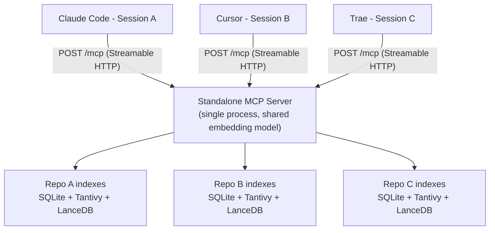
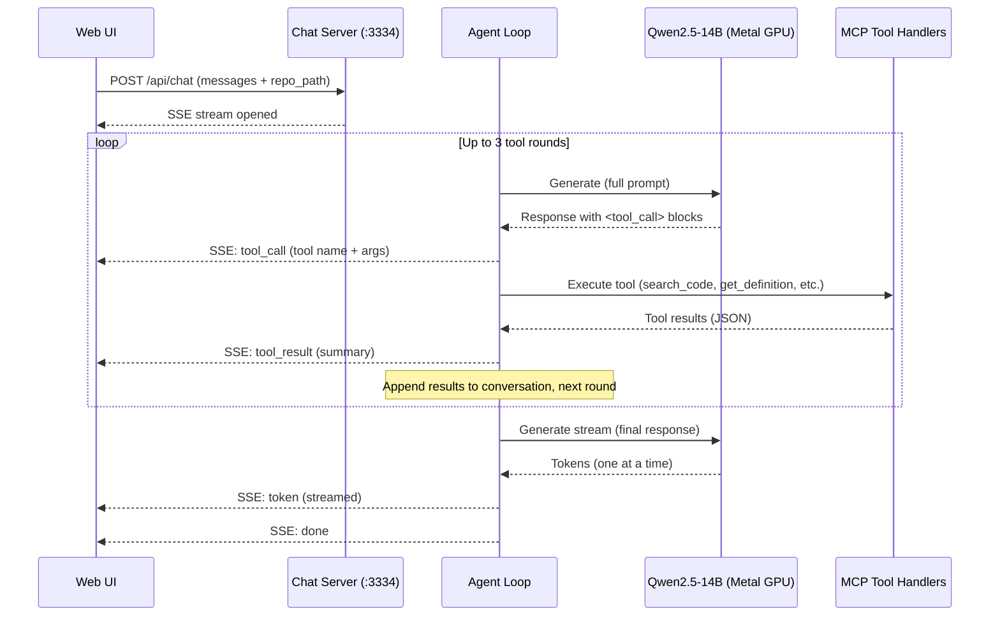
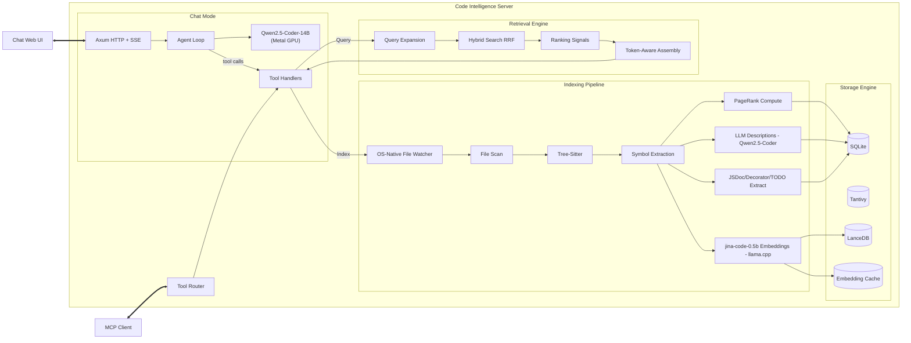

# Code Intelligence MCP Server

> **Semantic search and code navigation for LLM agents.**

[](https://www.npmjs.com/package/@iceinvein/code-intelligence-mcp)
[](LICENSE)
[](https://modelcontextprotocol.io)

---

This server indexes your codebase locally to provide **fast, semantic, and structure-aware** code navigation to tools like Claude Code, OpenCode, Trae, and Cursor.

## Why Use This Server?

Unlike basic text search, this server builds a local knowledge graph to understand your code.

* **Advanced Hybrid Search**: Combines keyword search ([BM25](#glossary) via Tantivy) with semantic vector search (via LanceDB + jina-code-embeddings-0.5b) using [Reciprocal Rank Fusion (RRF)](#glossary) — a technique that merges ranked results from different search systems by position rather than raw score.
* **Smart Context Assembly**: Token-aware budgeting with query-aware truncation that keeps relevant lines within context limits.
* **On-Device LLM Descriptions**: Automatically generates natural-language descriptions for every symbol using a local **Qwen2.5-Coder-1.5B** model (llama.cpp with Metal GPU), enriching search with human-readable summaries. This bridges the vocabulary gap between how developers search ("auth handler") and how code is named (`authenticate_request`).
* **PageRank Scoring**: Graph-based symbol importance scoring (similar to Google's original algorithm) that identifies central, heavily-used components by analyzing call graphs and type relationships.
* **Learns from Feedback**: Optional learning system that adapts to user selections over time.
* **Production First**: Multi-layer test detection (file paths, symbol names, and AST-level `#[test]`/`mod tests` analysis) ensures implementation code ranks above test helpers.
* **Multi-Repo Support**: Index and search across multiple repositories/monorepos simultaneously.
* **OS-Native File Watching**: Uses the `notify` crate with macOS FSEvents for instant re-indexing on file changes.
* **Built-in Chat UI**: Optional ChatGPT-style web interface powered by a local **Qwen2.5-Coder-14B** model. Ask questions about your codebase in the browser with live tool-call visibility and streaming responses.
* **Fast & Local**: Written in **Rust** with Metal GPU acceleration on Apple Silicon. Parallel indexing with persistent caching.

---

## Quick Start

Runs directly via `npx` without requiring a local Rust toolchain.

### Claude Code

Add to your MCP settings (global `~/.claude.json` or project-level `.mcp.json`):

```json
{
  "mcpServers": {
    "code-intelligence": {
      "command": "npx",
      "args": ["-y", "@iceinvein/code-intelligence-mcp"],
      "env": {}
    }
  }
}
```

Or install via the CLI:

```bash
claude mcp add code-intelligence -- npx -y @iceinvein/code-intelligence-mcp
```

Once connected, Claude Code gains 23 MCP tools for semantic search (`search_code`), symbol navigation (`get_definition`, `find_references`), call/type graphs (`get_call_hierarchy`, `get_type_graph`), impact analysis (`find_affected_code`, `trace_data_flow`), and more. The server auto-detects the working directory and begins indexing in the background.

### OpenCode / Trae

Add to your `opencode.json` (or global config):

```json
{
  "mcp": {
    "code-intelligence": {
      "type": "local",
      "command": ["npx", "-y", "@iceinvein/code-intelligence-mcp"],
      "enabled": true
    }
  }
}
```

*The server will automatically download the embedding model (~531MB) and LLM (~1.1GB) on first launch, then index your project in the background.*

---

## Standalone Server Mode

By default, each MCP client spawns its own server process (stdio transport). If you run multiple clients against the same repo, a per-repo leader lock (`flock()`) ensures only one instance performs indexing, file watching, and LLM description generation. The leader loads the LLM (~1.1GB) during indexing and automatically frees it once descriptions are complete. Follower instances never load the LLM — they open the search index read-only and pick up the leader's changes. All instances load their own copy of the embedding model (~531MB) for query-time vector search.

**Standalone mode** runs a single long-lived HTTP server that all clients share. The main advantage is cross-repo deduplication — in stdio mode, each instance loads its own embedding model regardless of which repo it's on. With 5 instances across 3 repos, that's 5 copies (~2.6GB). Standalone loads the models once and shares them across all repos and clients.

### Starting the Server

```bash
# Default: localhost:3333
npx @iceinvein/code-intelligence-mcp-standalone

# Custom host/port
npx @iceinvein/code-intelligence-mcp-standalone --port 4444 --host 0.0.0.0

# From source
./target/release/code-intelligence-mcp-server --standalone
./target/release/code-intelligence-mcp-server --standalone --port 4444

# Via environment variable
CIMCP_MODE=standalone ./target/release/code-intelligence-mcp-server
```

### Connecting MCP Clients

Point your MCP clients to the standalone server using Streamable HTTP transport:

**Claude Code** (`~/.claude.json` or project-level `.mcp.json`):
```json
{
  "mcpServers": {
    "code-intelligence": {
      "type": "streamable-http",
      "url": "http://localhost:3333/mcp"
    }
  }
}
```

Or via the CLI:
```bash
claude mcp add --transport http code-intelligence http://localhost:3333/mcp
```

**OpenCode** (`opencode.json`):
```json
{
  "mcp": {
    "code-intelligence": {
      "type": "remote",
      "url": "http://localhost:3333/mcp",
      "enabled": true
    }
  }
}
```

**Cursor** (`.cursor/mcp.json`):
```json
{
  "mcpServers": {
    "code-intelligence": {
      "url": "http://localhost:3333/mcp"
    }
  }
}
```

The server auto-detects each client's workspace root via the MCP `roots` capability — no `BASE_DIR` needed.

### How It Works


```mermaid
flowchart TB
  A[Claude Code - Session A] & B[Cursor - Session B] & C[Trae - Session C]
  A & B & C -- "POST /mcp (Streamable HTTP)" --> Server

  Server["Standalone MCP Server<br/>(single process, shared embedding model)"]

  Server --> RA["Repo A indexes<br/>SQLite + Tantivy + LanceDB"]
  Server --> RB["Repo B indexes<br/>SQLite + Tantivy + LanceDB"]
  Server --> RC["Repo C indexes<br/>SQLite + Tantivy + LanceDB"]
```

Each client session is bound to its workspace root. The server maintains separate indexes per repo but shares the embedding model across all of them.

### Data Storage

Both embedded (stdio) and standalone (HTTP) modes store all data in `~/.code-intelligence/`:

```text
~/.code-intelligence/
├── server.toml              # Optional config file (standalone only)
├── models/                  # Shared models (loaded once, shared across repos)
│   ├── jina-code-embeddings-0.5b-gguf/  # Embedding model (~531MB, GGUF via llama.cpp)
│   └── qwen2.5-coder-1.5b-gguf/  # LLM model (~1.1GB)
├── logs/
│   └── server.log
└── repos/
    ├── registry.json        # Tracks all known repos
    ├── a1b2c3d4e5f6a7b8/   # Per-repo data (SHA256 hash of repo path)
    │   ├── code-intelligence.db
    │   ├── tantivy-index/
    │   └── vectors/
    └── f8e7d6c5b4a3f2e1/
        └── ...
```

The same repo always maps to the same hash regardless of mode, so embedded and standalone can share the same index data.

### Configuration

Standalone mode is configured via `~/.code-intelligence/server.toml` (created on first run with defaults). Environment variables and CLI flags override TOML settings.

**Priority:** CLI flags > Environment variables > `server.toml` > Defaults

**Example `server.toml`:**

```toml
[server]
host = "127.0.0.1"
port = 3333

[embeddings]
backend = "llamacpp"        # llamacpp (default) or hash (testing)
device = "metal"            # cpu or metal (macOS GPU)

[repos.defaults]
index_patterns = "**/*.ts,**/*.tsx,**/*.rs,**/*.py,**/*.go"
exclude_patterns = "**/node_modules/**,**/dist/**,**/.git/**"
watch_mode = true           # Auto-reindex on file changes

[lifecycle]
warm_ttl_seconds = 300      # How long idle repos stay in memory
```

**Environment variable overrides (same as embedded mode):**

| Variable | Example | Description |
| -------- | ------- | ----------- |
| `CIMCP_MODE` | `standalone` | Alternative to `--standalone` flag |
| `EMBEDDINGS_BACKEND` | `hash` | Override embedding backend (`llamacpp` or `hash`) |
| `EMBEDDINGS_DEVICE` | `metal` | Override device (cpu/metal) |
| `EMBEDDINGS_MODEL_DIR` | `/path/to/model` | Override model directory |

---

## Chat Mode (Experimental)

Chat mode adds a **ChatGPT-style web UI** for asking questions about your codebase directly in the browser. It runs a local **Qwen2.5-Coder-14B** model with full Metal GPU acceleration and uses the same search and navigation tools that MCP clients get — meaning search quality improvements automatically benefit the chat experience.

Chat mode requires standalone mode and Apple Silicon with at least 16GB of unified memory.

### Quick Start

```bash
# Start standalone server with chat enabled
npx @iceinvein/code-intelligence-mcp-standalone --chat

# Or from source
./target/release/code-intelligence-mcp-server --standalone --chat

# Custom ports
./target/release/code-intelligence-mcp-server --standalone --port 3333 --chat --chat-port 4000

# Via environment variables
CIMCP_MODE=standalone CIMCP_CHAT=true ./target/release/code-intelligence-mcp-server
```

Once started, open **http://127.0.0.1:3334** in your browser.

On first launch, the 14B model (~9GB) is downloaded from HuggingFace and cached at `~/.code-intelligence/models/qwen2.5-coder-14b-gguf/`. The MCP server starts immediately — the model loads in the background and the chat UI becomes available once loading completes (typically 2-5 minutes on first run, seconds on subsequent launches).

### How It Works


```mermaid
sequenceDiagram
    participant Browser as Web UI
    participant Chat as Chat Server (:3334)
    participant Agent as Agent Loop
    participant LLM as Qwen2.5-14B (Metal GPU)
    participant Tools as MCP Tool Handlers

    Browser->>Chat: POST /api/chat (messages + repo_path)
    Chat-->>Browser: SSE stream opened

    loop Up to 3 tool rounds
        Agent->>LLM: Generate (full prompt)
        LLM-->>Agent: Response with <tool_call> blocks
        Agent-->>Browser: SSE: tool_call (tool name + args)
        Agent->>Tools: Execute tool (search_code, get_definition, etc.)
        Tools-->>Agent: Tool results (JSON)
        Agent-->>Browser: SSE: tool_result (summary)
        Note over Agent: Append results to conversation, next round
    end

    Agent->>LLM: Generate stream (final response)
    LLM-->>Agent: Tokens (one at a time)
    Agent-->>Browser: SSE: token (streamed)
    Agent-->>Browser: SSE: done
```

The agent uses up to **3 rounds** of tool calling before producing a final streamed response. Each round, the LLM can invoke any combination of 10 code intelligence tools to gather context before answering.

### Available Tools

The chat agent has access to a curated subset of the full MCP tool suite:

| Tool | Purpose |
| :--- | :------ |
| `search_code` | Hybrid semantic + keyword search |
| `get_definition` | Jump to symbol source code |
| `find_references` | Find all usages of a symbol |
| `get_call_hierarchy` | Navigate callers and callees |
| `get_type_graph` | Explore type inheritance |
| `explore_dependency_graph` | Trace module imports/exports |
| `get_file_symbols` | List all symbols in a file |
| `find_affected_code` | Impact analysis (reverse dependencies) |
| `trace_data_flow` | Follow variable reads and writes |
| `summarize_file` | Structural file overview |

### Web UI Features

- **Live token streaming** — responses appear word-by-word as the model generates
- **Tool call visibility** — see which tools the model invokes and their results in real-time
- **Multi-turn conversation** — full chat history maintained across turns
- **Markdown rendering** — code blocks with syntax highlighting (via highlight.js)
- **Dark/light theme** — toggle between themes with the header button
- **Repo selector** — specify the repository path to query against
- **Keyboard shortcuts** — Enter to send, Shift+Enter for newline

### Configuration

| Setting | CLI Flag | Env Var | Default | Description |
| :------ | :------- | :------ | :------ | :---------- |
| Enable chat | `--chat` | `CIMCP_CHAT=true` | off | Activate chat mode |
| Chat port | `--chat-port PORT` | `CIMCP_CHAT_PORT=PORT` | `3334` | HTTP port for the chat UI |

**Priority:** CLI flags > Environment variables > Defaults

### API Reference

The chat server exposes three HTTP endpoints:

**`GET /`** — Serves the web UI (single-page HTML with embedded CSS/JS).

**`GET /api/status`** — Returns model loading status.
```json
{"model_loaded": true, "model_name": "Qwen2.5-Coder-14B-Instruct"}
```

**`POST /api/chat`** — Starts a streaming chat session. Returns an SSE event stream.

Request body:
```json
{
  "messages": [
    {"role": "user", "content": "How does the ranking system work?"}
  ],
  "repo_path": "/absolute/path/to/your/repo"
}
```

SSE event types:

| Event | Data | Description |
| :---- | :--- | :---------- |
| `token` | `{"type":"token","content":"The "}` | A generated text token |
| `tool_call` | `{"type":"tool_call","tool":"search_code","args":{...}}` | Tool invocation started |
| `tool_result` | `{"type":"tool_result","tool":"search_code","summary":"..."}` | Tool execution completed |
| `error` | `{"type":"error","message":"..."}` | Non-recoverable error |
| `done` | `{"type":"done"}` | Stream complete |

### Model Details

| Property | Value |
| :------- | :---- |
| Model | Qwen2.5-Coder-14B-Instruct |
| Format | GGUF Q4_K_M (~9 GB) |
| Context window | 8,192 tokens |
| Max generation | 2,048 tokens per response |
| GPU offloading | All layers via Metal |
| Sampling | Temperature 0.7 |
| HuggingFace repo | `Qwen/Qwen2.5-Coder-14B-Instruct-GGUF` |
| Cache location | `~/.code-intelligence/models/qwen2.5-coder-14b-gguf/` |

### Limitations

- **Standalone-only** — chat is not available in embedded (stdio) mode since it requires a persistent HTTP server
- **Apple Silicon required** — the 14B model needs Metal GPU acceleration; 16GB+ unified memory recommended
- **Context budget** — the 8K token context window is shared between conversation history, tool definitions, and tool results; long conversations may lose early context
- **Tool result truncation** — individual tool results are capped at 4,000 characters to preserve context budget
- **No authentication** — the chat server binds to localhost only; do not expose to the network without adding an auth layer
- **Single-threaded generation** — one chat request is processed at a time; concurrent requests queue

---

## Capabilities

Available tools for the agent (23 tools total):

### Core Search & Navigation

| Tool                       | Description                                                                                                                                                             |
| :------------------------- | :---------------------------------------------------------------------------------------------------------------------------------------------------------------------- |
| `search_code`              | **Primary Search.** Finds code by meaning ("how does auth work?") or structure ("class User"). Supports query decomposition (e.g., "authentication and authorization"). |
| `get_definition`           | Retrieves the full definition of a specific symbol with disambiguation support.                                                                                         |
| `find_references`          | Finds all usages of a function, class, or variable.                                                                                                                     |
| `get_call_hierarchy`       | Specifies upstream callers and downstream callees.                                                                                                                      |
| `get_type_graph`           | Explores inheritance (extends/implements) and type aliases.                                                                                                             |
| `explore_dependency_graph` | Explores module-level dependencies upstream or downstream.                                                                                                              |
| `get_file_symbols`         | Lists all symbols defined in a specific file.                                                                                                                           |
| `get_usage_examples`       | Returns real-world examples of how a symbol is used in the codebase.                                                                                                    |

### Advanced Analysis

| Tool                     | Description                                                                               |
| :----------------------- | :---------------------------------------------------------------------------------------- |
| `explain_search`         | Returns detailed scoring breakdown to understand why results ranked as they did.          |
| `find_similar_code`      | Finds code semantically similar to a given symbol or code snippet.                        |
| `trace_data_flow`        | Traces variable reads and writes through the codebase to understand data flow.            |
| `find_affected_code`     | Finds code that would be affected if a symbol changes (reverse dependencies).             |
| `get_similarity_cluster` | Returns symbols in the same semantic similarity cluster as a given symbol.                |
| `summarize_file`         | Generates a summary of file contents including symbol counts, structure, and key exports. |
| `get_module_summary`     | Lists all exported symbols from a module/file with their signatures.                      |

### Testing, Frameworks & Documentation

| Tool                       | Description                                                                                                               |
| :------------------------- | :------------------------------------------------------------------------------------------------------------------------ |
| `search_todos`             | Searches for TODO and FIXME comments to track technical debt.                                                             |
| `find_tests_for_symbol`    | Finds test files that test a given symbol or source file.                                                                 |
| `search_decorators`        | Searches for TypeScript/JavaScript decorators (@Component, @Controller, @Get, @Post, etc.).                               |
| `search_framework_patterns`| Searches for framework-specific patterns (e.g., Elysia routes, WebSocket handlers, middleware) with method/path filtering.|

### Context & Learning

| Tool               | Description                                                                     |
| :----------------- | :------------------------------------------------------------------------------ |
| `hydrate_symbols`  | Hydrates full context for a set of symbol IDs.                                  |
| `report_selection` | Records user selection feedback for learning (call when user selects a result). |
| `refresh_index`    | Manually triggers a re-index of the codebase.                                   |
| `get_index_stats`  | Returns index statistics (files, symbols, edges, last updated).                 |

---

## Supported Languages

The server supports semantic navigation and symbol extraction for the following languages:

* **Rust**
* **TypeScript / TSX**
* **JavaScript**
* **Python**
* **Go**
* **Java**
* **C**
* **C++**

---

## Smart Ranking & Context Enhancement

The search pipeline runs two parallel searches — keyword (BM25 via Tantivy) and semantic (vector embeddings via LanceDB) — then merges them using Reciprocal Rank Fusion (RRF). On top of this hybrid base, the ranking engine applies structural signals to optimize for relevance:

1. **PageRank Symbol Importance**: Graph-based scoring that identifies central, heavily-used components (similar to Google's PageRank).
2. **Reciprocal Rank Fusion (RRF)**: Combines keyword, vector, and graph search results using statistically optimal rank fusion.
3. **Query Decomposition**: Complex queries ("X and Y") are automatically split into sub-queries for better coverage.
4. **Token-Aware Truncation**: Context assembly keeps query-relevant lines within token budgets using BM25-style relevance scoring.
5. **LLM-Enriched Indexing**: On-device Qwen2.5-Coder generates natural-language descriptions for each symbol, bridging the vocabulary gap between how developers search and how code is named.
6. **Morphological Variants**: Function names are expanded with stems and derivations (e.g., `watch` → `watcher`, `index` → `reindex`) to improve recall for natural-language queries.
7. **Multi-Layer Test Detection**: Three mechanisms — file path patterns (`*.test.ts`), symbol name heuristics (`test_*`), and SQL-based AST analysis (`#[test]`, `mod tests`) — with a final enforcement pass that prevents test code from escaping via edge expansion.
8. **Edge Expansion**: High-ranking symbols pull in structurally related code (callers, type members) with importance filtering to avoid noise from private helpers.
9. **Directory Semantics**: Implementation directories (`src`, `lib`, `app`) are boosted, while build artifacts (`dist`, `build`) and `node_modules` are penalized.
10. **Exported Symbol Boost**: Exported/public symbols receive a ranking boost as they represent the primary API surface.
11. **Glue Code Filtering**: Re-export files (e.g., `index.ts`) are deprioritized in favor of the actual implementation.
12. **JSDoc Boost**: Symbols with documentation receive a ranking boost, and examples are included in search results.
13. **Learning from Feedback** (optional): Tracks user selections to personalize future search results.
14. **Package-Aware Scoring** (multi-repo): Boosts results from the same package when working in monorepos.

### Intent Detection

The system detects query intent and adjusts ranking accordingly:

| Query Pattern     | Intent                    | Effect                                  |
| ----------------- | ------------------------- | --------------------------------------- |
| "struct User"     | Definition                | Boosts type definitions (1.5x)          |
| "who calls login" | Callers                   | Triggers graph lookup                   |
| "verify login"    | Testing                   | Boosts test files                       |
| "User schema"     | Schema/Model              | Boosts schema/model files (50-75x)      |
| "auth and authz"  | Multi-query decomposition | Splits into sub-queries, merges via RRF |

For a deep dive into the system's design, see [System Architecture](SYSTEM_ARCHITECTURE.md).

---

## Glossary

Key terms used throughout this documentation:

| Term | Full Name | What It Means |
|------|-----------|---------------|
| **MCP** | Model Context Protocol | An open protocol for connecting LLM-based tools (like Claude Code, Cursor, OpenCode) to external data sources and capabilities. This server implements MCP to expose code search and navigation tools. |
| **BM25** | Best Matching 25 | A probabilistic text search algorithm (used by Tantivy). Ranks results by how often your search terms appear in a document (term frequency) weighted by how rare those terms are across all documents (inverse document frequency / IDF). The standard algorithm behind most full-text search engines. |
| **IDF** | Inverse Document Frequency | A component of BM25 that measures how rare a term is. A term like `authenticate` appearing in only 3 files has high IDF (very discriminating), while `error` appearing in 200 files has low IDF (less useful for ranking). |
| **RRF** | Reciprocal Rank Fusion | A technique for merging ranked result lists from different search systems. Instead of comparing raw scores (which have different scales), RRF uses rank positions: a result ranked #1 in keyword search and #3 in vector search gets a combined score based on those positions. This makes it robust when combining fundamentally different search approaches. |
| **GGUF** | GGML Unified Format | A binary format for storing quantized (compressed) neural network weights. Used by llama.cpp to run both the embedding model and the LLM efficiently on consumer hardware. Q4_K_M quantization reduces the 1.5B parameter model from ~3GB to ~1.1GB with minimal quality loss. |
| **LLM** | Large Language Model | In this project, a local Qwen2.5-Coder-1.5B model that generates one-sentence natural-language descriptions for each code symbol (function, class, type). These descriptions are indexed alongside the code, helping BM25 match natural-language queries to technically-named code. |
| **PageRank** | — | A graph algorithm (originally from Google Search) adapted here to score symbol importance. Symbols that are called/referenced by many other symbols get higher PageRank scores, indicating they are central to the codebase. |
| **Tree-Sitter** | — | A parser generator that builds concrete syntax trees (CSTs) for source code. Used to extract symbols (functions, classes, types), their relationships (calls, imports, type hierarchies), and structural information from 8 supported languages. |

---

## Configuration (Optional)

Works without configuration by default. You can customize behavior via environment variables:

### Core Settings

```json
"env": {
  "BASE_DIR": "/path/to/repo",           // Required: Repository root
  "WATCH_MODE": "true",                  // Watch for file changes (Default: true)
  "INDEX_PATTERNS": "**/*.ts,**/*.go",   // File patterns to index
  "EXCLUDE_PATTERNS": "**/node_modules/**",
  "REPO_ROOTS": "/path/to/repo1,/path/to/repo2"  // Multi-repo support
}
```

### Embedding Model

```json
"env": {
  "EMBEDDINGS_BACKEND": "llamacpp",      // llamacpp (default) or hash (testing)
  "EMBEDDINGS_DEVICE": "cpu",            // cpu or metal (macOS GPU)
  "EMBEDDING_BATCH_SIZE": "32"
}
```

### Context Assembly

```json
"env": {
  "MAX_CONTEXT_TOKENS": "8192",          // Token budget for context (default: 8192)
  "TOKEN_ENCODING": "o200k_base",        // tiktoken encoding model
  "MAX_CONTEXT_BYTES": "200000"          // Legacy byte-based limit (fallback)
}
```

### Ranking & Retrieval

```json
"env": {
  "RANK_EXPORTED_BOOST": "1.0",          // Boost for exported symbols
  "RANK_TEST_PENALTY": "0.1",            // Penalty for test files
  "RANK_POPULARITY_WEIGHT": "0.05",      // PageRank influence
  "RRF_ENABLED": "true",                 // Enable Reciprocal Rank Fusion
  "HYBRID_ALPHA": "0.7"                  // Vector vs keyword weight (0-1)
}
```

### Learning System (Optional)

```json
"env": {
  "LEARNING_ENABLED": "false",           // Enable selection tracking (default: false)
  "LEARNING_SELECTION_BOOST": "0.1",     // Boost for previously selected symbols
  "LEARNING_FILE_AFFINITY_BOOST": "0.05" // Boost for frequently accessed files
}
```

### Performance

```json
"env": {
  "PARALLEL_WORKERS": "1",               // Indexing parallelism (default: 1 for SQLite)
  "EMBEDDING_CACHE_ENABLED": "true",     // Persistent embedding cache
  "PAGERANK_ITERATIONS": "20",           // PageRank computation iterations
  "METRICS_ENABLED": "true",             // Prometheus metrics
  "METRICS_PORT": "9090"
}
```

### Query Expansion

```json
"env": {
  "SYNONYM_EXPANSION_ENABLED": "true",   // Expand "auth" → "authentication"
  "ACRONYM_EXPANSION_ENABLED": "true"    // Expand "db" → "database"
}
```

---

## Architecture


```mermaid
flowchart LR
  Client[MCP Client] <==> Tools
  Browser[Chat Web UI] <==> ChatServer

  subgraph Server [Code Intelligence Server]
    direction TB
    Tools[Tool Router]

    subgraph Chat [Chat Mode]
      direction TB
      ChatServer[Axum HTTP + SSE] --> Agent[Agent Loop]
      Agent --> ChatLLM["Qwen2.5-Coder-14B<br/>(Metal GPU)"]
      Agent -- "tool calls" --> Handlers
    end

    subgraph Indexer [Indexing Pipeline]
      direction TB
      Watch[OS-Native File Watcher] --> Scan[File Scan]
      Scan --> Parse[Tree-Sitter]
      Parse --> Extract[Symbol Extraction]
      Extract --> PageRank[PageRank Compute]
      Extract --> Embed[jina-code-0.5b Embeddings - llama.cpp]
      Extract --> LLMDesc[LLM Descriptions - Qwen2.5-Coder]
      Extract --> JSDoc[JSDoc/Decorator/TODO Extract]
    end

    subgraph Storage [Storage Engine]
      direction TB
      SQLite[(SQLite)]
      Tantivy[(Tantivy)]
      Lance[(LanceDB)]
      Cache[(Embedding Cache)]
    end

    subgraph Retrieval [Retrieval Engine]
      direction TB
      QueryExpand[Query Expansion]
      Hybrid[Hybrid Search RRF]
      Signals[Ranking Signals]
      Context[Token-Aware Assembly]
    end

    Handlers[Tool Handlers]
    Tools --> Handlers
    Handlers -- Index --> Watch
    PageRank --> SQLite
    Embed --> Lance
    Embed --> Cache
    LLMDesc --> SQLite
    JSDoc --> SQLite

    Handlers -- Query --> QueryExpand
    QueryExpand --> Hybrid
    Hybrid --> Signals
    Signals --> Context
    Context --> Handlers
  end
```

---

## Development

1. **Prerequisites**: Rust (stable), `protobuf`.
2. **Build**: `cargo build --release`
3. **Run**: `./scripts/start_mcp.sh`
4. **Test**: `cargo test` or `EMBEDDINGS_BACKEND=hash cargo test` (faster, skips model download)

### Quick Testing with Hash Backend

For faster development iteration, use the hash embedding backend which skips model downloads:

```bash
EMBEDDINGS_BACKEND=hash BASE_DIR=/path/to/repo ./target/release/code-intelligence-mcp-server
```

### Project Structure

```text
src/
├── chat/              # Chat mode (--chat flag, standalone only)
│   ├── mod.rs         # Axum HTTP server, SSE streaming, routes
│   ├── agent.rs       # Multi-round agent loop, prompt building, tool call parsing
│   ├── llm.rs         # ChatLlm (Qwen2.5-Coder-14B via llama.cpp, Metal GPU)
│   ├── tools.rs       # Tool definitions (JSON) + dispatch to handlers
│   └── ui.html        # Single-file web UI (vanilla JS, marked.js, highlight.js)
├── indexer/
│   ├── extract/       # Language-specific symbol extractors (Rust, TS, Python, Go, Java, C, C++)
│   ├── pipeline/      # Indexing pipeline stages (scan, parse, embed, watch, describe)
│   └── package/       # Package detection (npm, Cargo, Go, Python)
├── storage/
│   ├── sqlite/        # SQLite schema, queries, operations
│   ├── tantivy.rs     # BM25 full-text search with n-gram tokenization
│   └── vector.rs      # LanceDB vector embeddings
├── retrieval/
│   ├── ranking/       # Scoring signals, RRF, diversity, edge expansion, reranker
│   ├── assembler/     # Token-aware context assembly and formatting
│   ├── hyde/          # Hypothetical document expansion
│   ├── mod.rs         # Search pipeline orchestrator
│   ├── hybrid.rs      # Hybrid BM25 + vector scoring loop
│   └── postprocess.rs # Final enforcement, vector promotion
├── graph/             # PageRank, call hierarchy, type graphs
├── handlers/          # MCP tool handlers (shared by MCP server + chat agent)
├── server/            # MCP protocol routing (embedded + standalone)
│   ├── mod.rs         # Shared tool dispatch, embedded handler
│   └── standalone.rs  # Standalone HTTP handler with session routing
├── tools/             # Tool definitions (23 MCP tools)
├── embeddings/        # jina-code-0.5b embedding model (GGUF via llama.cpp)
├── llm/               # On-device LLM (Qwen2.5-Coder-1.5B via llama.cpp, for descriptions)
├── reranker/          # Reranker trait and cache (currently disabled)
├── path/              # Cross-platform path normalization (camino)
├── text.rs            # Text processing (synonym expansion, morphological variants)
├── metrics/           # Prometheus metrics
├── config.rs          # Configuration (embedded + standalone)
├── session.rs         # Multi-repo session management (standalone)
└── registry.rs        # Repo registry with path hashing (standalone)
```

## License

MIT
