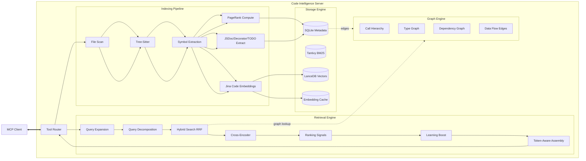

# Code Intelligence System Architecture

This document outlines the architecture of the Code Intelligence MCP Server v1.0.0. The system provides fast, semantic, and structure-aware code navigation for LLM agents by building a local knowledge graph of the codebase with advanced retrieval and ranking capabilities.

## High-Level Overview

The system operates as a local indexing and retrieval engine. It scans the user's codebase, extracts semantic symbols (classes, functions, etc.), generates vector embeddings using Jina Code, builds a knowledge graph with PageRank scoring, and provides intelligent search with cross-encoder reranking and query-aware context assembly.

## System Architecture Diagram



## Core Components

### 1. Indexing Pipeline (`src/indexer`)

The indexing pipeline transforms raw source code into structured, searchable data.

#### File Scan (`src/indexer/scanner.rs`)

- Identifies relevant files using glob patterns
- Respects `.gitignore` and exclude patterns
- Multi-repo support via `REPO_ROOTS` configuration
- Parallel file discovery with configurable workers

#### Parsing (`src/indexer/parser.rs`)

- Uses **Tree-Sitter** for language-agnostic AST parsing
- Supports 9 languages: Rust, TypeScript, JavaScript, Python, Go, Java, C, C++
- Error-tolerant parsing continues on syntax errors

#### Symbol Extraction (`src/indexer/extract/`)

Language-specific extractors walk the AST to identify:

- **Symbols**: Functions, classes, structs, interfaces, methods, variables
- **Metadata**: Range, visibility, modifiers, documentation
- **Relationships**: Calls, extends, implements, reads, writes
- **Decorators**: TypeScript/JavaScript decorators (@Component, @Get, etc.)
- **JSDoc**: @param, @returns, @example, @deprecated, @throws, @see, @since
- **TODOs**: TODO and FIXME comments with context

#### PageRank Computation (`src/graph/pagerank.rs`)

- Graph-based importance scoring for all symbols
- Iterative algorithm (default: 20 iterations, damping: 0.85)
- Identifies "central" components that are heavily referenced
- Used as ranking signal for search results

### 2. Embedding Engine (`src/embeddings`)

#### Jina Code Model (`src/embeddings/jina_code.rs`)

- **Default model**: `jinaai/jina-embeddings-v2-base-code`
- 768-dimensional embeddings optimized for code
- ONNX runtime for efficient inference
- CPU and Metal (macOS GPU) support
- Batch processing with configurable batch size

#### Embedding Cache (`src/storage/cache.rs`)

- Persistent caching of generated embeddings
- Content-addressed by file hash
- Dramatically speeds up re-indexing
- Configurable via `EMBEDDING_CACHE_ENABLED`

### 3. Storage Engine (`src/storage`)

Multi-modal storage approach optimized for different query patterns:

#### SQLite (`src/storage/sqlite/`)

Relational metadata storage:

- **Symbols**: ID, name, kind, file path, range, export status, PageRank score
- **Edges**: Relationships (calls, extends, implements, reads, writes)
- **JSDoc**: Documentation entries with tags
- **Decorators**: Decorator metadata with types
- **TODOs**: TODO/FIXME comments
- **Test Links**: Bidirectional test-to-source mappings
- **Packages**: Package detection for monorepo scoring
- **Learning**: User selection feedback

#### Tantivy (`src/storage/tantivy.rs`)

- High-performance full-text search engine
- BM25 ranking with n-gram tokenization
- Fuzzy search and exact identifier matching
- Optimized for keyword queries

#### LanceDB (`src/storage/vector.rs`)

- Vector database for semantic similarity search
- Stores 768-dim Jina Code embeddings
- Cosine distance for similarity scoring
- Configurable search limit

### 4. Retrieval Engine (`src/retrieval`)

The heart of the system with advanced search and ranking capabilities.

#### Query Expansion (`src/retrieval/expansion/`)

- **Synonym Expansion**: "auth" → "authentication", "db" → "database"
- **Acronym Expansion**: "id" → "identifier", "req" → "request"
- Configurable via `SYNONYM_EXPANSION_ENABLED` and `ACRONYM_EXPANSION_ENABLED`

#### Query Decomposition (`src/retrieval/mod.rs`)

- Splits complex queries: "authentication and authorization" → ["authentication", "authorization"]
- Enables multi-query search for better coverage
- Results merged via Reciprocal Rank Fusion (RRF)

#### Hybrid Search with RRF (`src/retrieval/hybrid.rs`)

- Parallel queries to Tantivy (keyword), LanceDB (vector), and graph (links)
- **Reciprocal Rank Fusion**: Statistically optimal rank combination
  - Formula: `1 / (k + rank)` for each source
  - Configurable `RRF_K` (default: 60.0)
  - Per-source weights: `RRF_KEYWORD_WEIGHT`, `RRF_VECTOR_WEIGHT`, `RRF_GRAPH_WEIGHT`

#### Cross-Encoder Reranking (`src/reranker/`)

- ONNX Runtime-based deep learning reranker
- Always-on for precision result ranking
- Top-K reranking (default: 20) to balance quality and latency
- Query-document relevance scoring

#### Ranking Signals (`src/retrieval/ranking/score.rs`)

Sophisticated scoring pipeline with multiple signals:

1. **PageRank Boost**: Graph-based importance (0.05 × score)
2. **Test Penalty**: 0.5x multiplier unless test intent
3. **Glue Code Filtering**: -5.0 penalty for re-export files
4. **Directory Semantics**:
   - `dist`, `build`, `node_modules`: -15.0 penalty
   - `src`, `lib`, `app`: +1.0 boost
   - Path matching: +2.0 boost
5. **Export Boost**: +0.1 for exported symbols
6. **Intent Multipliers**:
   - Definitions: 1.5x boost
   - Schema: 50-75x boost
7. **JSDoc Boost**: 1.5x for documented symbols
8. **Learning Boost**: User selection feedback (optional)
9. **Package Boost**: Same-package boost in monorepos

#### Intent Detection (`src/retrieval/intent.rs`)

Query understanding for specialized ranking:

- `Intent::Definition`: "struct User", "class AuthService"
- `Intent::Callers`: "who calls login", "find callers"
- `Intent::Test`: "verify login", "test authentication"
- `Intent::Schema`: "User model", "schema definition"

### 5. Context Assembly (`src/retrieval/assembler/`)

Token-aware context formatting with query-aware truncation.

#### Token Budgeting (`src/retrieval/assembler/formatting.rs`)

- tiktoken-based token counting (default: `o200k_base`)
- Configurable via `MAX_CONTEXT_TOKENS` (default: 8192)
- Respects token limits, not byte limits

#### Query-Aware Truncation (`src/retrieval/assembler/formatting.rs`)

- **BM25-style relevance scoring**: Ranks lines by query relevance
- Keeps query-relevant lines within token budget
- First sub-query used for multi-query relevance
- Query hash included in cache key for freshness

#### Formatting Modes (`src/retrieval/assembler/mod.rs`)

- **Compact**: Minimal formatting, max code density
- **Standard**: Balanced formatting with metadata
- **Verbose**: Full context with all metadata

### 6. Graph Engine (`src/graph/`)

Knowledge graph for code relationship understanding.

#### Call Hierarchy (`src/graph/calls.rs`)

- Navigates `call` edges bidirectionally
- Upstream: Find all callers of a function
- Downstream: Find all functions called by a symbol

#### Type Graph (`src/graph/types.rs`)

- Navigates `extends`, `implements`, `alias` edges
- Inheritance hierarchy exploration
- Type alias resolution

#### Dependency Graph (`src/graph/dependencies.rs`)

- Module-level dependency tracking
- Upstream: Find all dependencies
- Downstream: Find all dependents

#### Data Flow (`src/graph/dataflow.rs`)

- Tracks `reads` and `writes` edges
- Variable usage tracing
- Impact analysis for changes

### 7. Learning System (`src/learning/`)

Optional adaptive ranking based on user feedback.

#### Selection Tracking (`src/learning/tracker.rs`)

- Records user selections via `report_selection` tool
- Tracks symbol-level and file-level affinity
- Stored in SQLite for persistence

#### Personalization (`src/retrieval/ranking/learning.rs`)

- Boosts previously selected symbols (configurable)
- File affinity boosting for frequent access
- Disabled by default (`LEARNING_ENABLED=false`)

### 8. Metrics (`src/metrics/`)

Prometheus metrics for observability:

- Search latency: `search_duration_ms`
- Component timing: `keyword_ms`, `vector_ms`, `reranker_ms`
- Index stats: `symbols_indexed`, `files_indexed`
- Cache performance: `embedding_cache_hit_rate`

Exposes on port 9090 (configurable via `METRICS_PORT`).

## Data Flow: Complete Search Request

### 1. Query Input

```
User: "authentication and authorization"
```

### 2. Query Expansion & Decomposition

- Expand synonyms: "auth" → "authentication"
- Decompose: ["authentication", "authorization"]

### 3. Parallel Hybrid Search (per sub-query)

- **Tantivy**: BM25 keyword search for "authentication"
- **LanceDB**: Vector similarity for "authentication"
- **Graph**: Link traversal for related symbols

### 4. Rank Fusion

- Combine results from all sources using RRF
- Merge sub-queries using unified RRF
- First sub-query used for cross-encoder reranking

### 5. Cross-Encoder Reranking

- Deep learning model re-scores top 20 results
- Precision tuning of result order

### 6. Signal Application

- Apply PageRank, test penalty, directory semantics
- Apply intent-based boosts
- Apply learning boosts (if enabled)
- Apply JSDoc and package boosts

### 7. Context Assembly

- Select top results within token budget
- Fetch full symbol definitions
- Apply query-aware truncation to keep relevant lines
- Format with JSDoc examples and metadata

### 8. Response

```json
{
  "results": [
    {
      "symbol": "AuthService",
      "file": "src/auth/service.ts",
      "relevance_score": 0.95,
      "context": "..."
    }
  ],
  "query_explanation": {
    "original": "authentication and authorization",
    "decomposed": ["authentication", "authorization"],
    "intent": "standard"
  }
}
```

## MCP Tools (19 Total)

See README.md for complete tool list. Key categories:

### Core Search

- `search_code`: Primary search with query decomposition
- `get_definition`: Symbol definition with disambiguation
- `find_references`: Find all usages
- `get_call_hierarchy`: Callers and callees
- `get_type_graph`: Type relationships

### Advanced Analysis

- `explain_search`: Scoring breakdown
- `find_similar_code`: Semantic similarity
- `trace_data_flow`: Variable usage tracing
- `find_affected_code`: Impact analysis
- `summarize_file`: File overview
- `get_module_summary`: Exported symbols

### Testing & Documentation

- `search_todos`: TODO/FIXME search
- `find_tests_for_symbol`: Test-to-code linking
- `search_decorators`: Decorator search

### Context & Learning

- `hydrate_symbols`: Batch symbol context
- `report_selection`: Learning feedback
- `refresh_index`: Re-indexing
- `get_index_stats`: Index statistics

## Performance Characteristics

### Indexing

- **Initial Index**: ~2-3 min for 10k files (Jina Code model download)
- **Re-index**: ~30-60 sec with cache (parallel workers)
- **Incremental**: ~100-500 ms per changed file (watch mode)

### Search Latency

- **Cold Search**: ~500-1000 ms (first query, no cache)
- **Warm Search**: ~50-200 ms (cached embeddings, indices loaded)
- **Components**:
  - Tantivy: 10-50 ms
  - LanceDB: 20-100 ms
  - Cross-encoder: 20-50 ms (top-20)

### Storage

- **SQLite**: ~1-5 MB per 10k symbols
- **Tantivy**: ~50-200 MB per 10k symbols
- **LanceDB**: ~100-500 MB per 10k symbols (768-dim vectors)
- **Cache**: ~200 MB per 10k symbols (embeddings)

## Configuration

See README.md for complete environment variable reference. Key settings:

- `EMBEDDINGS_BACKEND`: `jinacode` (default), `fastembed`, `hash`
- `EMBEDDINGS_DEVICE`: `cpu`, `metal`
- `MAX_CONTEXT_TOKENS`: `8192` (default)
- `LEARNING_ENABLED`: `false` (default)
- `RRF_ENABLED`: `true` (default)
- `PARALLEL_WORKERS`: `1` (default, for SQLite)
- `REPO_ROOTS`: Multi-repo support

## Technology Stack

- **Language**: Rust 2021
- **Parsing**: Tree-Sitter (9 languages)
- **Storage**: SQLite, Tantivy, LanceDB
- **Embeddings**: Jina Code (ONNX), optional FastEmbed
- **Reranking**: ONNX Runtime (cross-encoder)
- **Tokenization**: tiktoken (o200k_base)
- **Protocol**: Model Context Protocol (MCP)
- **Metrics**: Prometheus
