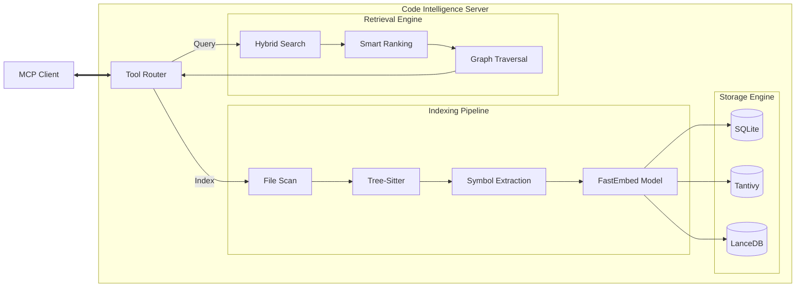

# Code Intelligence System Architecture

This document outlines the architecture of the Code Intelligence MCP Server context engine. The system provides fast, semantic, and structure-aware code navigation for LLM agents by building a local knowledge graph of the codebase.

## High-Level Overview

The system operates as a local indexing and retrieval engine. It scans the user's codebase, extracts semantic symbols (classes, functions, etc.), generates vector embeddings, and builds a knowledge graph. When an agent queries the system, it uses a hybrid search approach combined with smart ranking heuristics to return the most relevant code context.

## System Architecture Diagram

## Core Components

### 1. Indexing Pipeline (`src/indexer`)

The indexing pipeline transforms raw source code into structured data.

- **File Scan**: Identifies relevant files, ignoring gitignored and binary files.
- **Parsing**: Uses **Tree-Sitter** to parse code into an Abstract Syntax Tree (AST) for supported languages (Rust, TypeScript, Python, Go, Java, C/C++).
- **Symbol Extraction**: specialized extractors (`src/indexer/extract`) walk the AST to identify symbols (functions, classes, structs, interfaces) and their metadata (range, documentation, modifiers).
- **Embeddings**: The **FastEmbed** model generates dense vector embeddings for the extracted symbol text.

### 2. Storage Engine (`src/storage`)

The system uses a multi-modal storage approach to optimize for different query types:

- **SQLite (`src/storage/sqlite`)**: Stores relational metadata:
  - **Symbols**: ID, name, kind, file path, range, export status.
  - **Edges**: Relationships between symbols (calls, extends, implements).
  - **Search Runs**: Telemetry for search performance.
- **Tantivy (`src/storage/tantivy`)**: A high-performance full-text search engine for **keyword matching**. It handles fuzzy search, exact identifier matching, and text scoring.
- **LanceDB (`src/storage/vector`)**: A vector database for **semantic search**. It stores the embeddings generated by FastEmbed to allow finding code by "meaning" rather than just keywords.

### 3. Retrieval Engine (`src/retrieval`)

The heart of the system, responsible for finding and ranking relevant code.

- **Hybrid Search**: Executes parallel queries against Tantivy (keywords) and LanceDB (vectors).
- **Intent Detection**: Analyzes the user's query to determine intent:
  - `Intent::Definition`: "struct User"
  - `Intent::Callers`: "who calls login"
  - `Intent::Test`: "verify login"
  - `Intent::Schema`: "User model"
- **Context Assembly**: Fetches the full text of matched symbols and formats them for the LLM.

### 4. Graph Engine (`src/graph`)

Builds and traverses the knowledge graph to understand code relationships.

- **Dependency Graph**: Tracks upstream and downstream dependencies.
- **Call Hierarchy**: Navigates `call` edges to find callers and callees.
- **Type Graph**: Navigates `extends`, `implements`, and `alias` edges to understand type hierarchies.

## Major Enhancements: The Context Engine

The recent enhancements focus on "Smart Ranking" and "Graph-Augmented Context" to significantly improve retrieval quality.

### Hybrid Search V2

The retrieval process now fuses results using a weighted scoring model:

- **Vector Score**: Semantic similarity (cosine distance).
- **Keyword Score**: BM25/TF-IDF score from Tantivy.
- **Normalization**: Scores are normalized relative to the best hit in the batch to make them comparable.

### Smart Ranking Signals (`src/retrieval/ranking/score.rs`)

A sophisticated scoring pipeline applies "signals" to adjust the final rank of each hit:

1. **Test Penalty**: Test files (`*.test.ts`, `__tests__`) receive a **0.5x multiplier** unless the query intent is explicitly `Intent::Test`. This prevents tests from cluttering results when looking for implementation.
2. **Glue Code Filtering**: Re-export files like `index.ts` receive a **-5.0 score penalty** to prioritize actual implementation files.
3. **Directory Semantics**:
    - **Build/Gen**: `dist`, `build`, `node_modules` get a **-15.0 penalty**.
    - **Src/Lib**: `src`, `lib`, `app` get a **+1.0 boost**.
    - **Path Matching**: If a query term matches a path segment (e.g., query "auth" matches `src/auth/service.ts`), it gets a **+2.0 boost**.
4. **Export Boost**: Exported symbols receive a configuration-defined score boost.
5. **Intent Multipliers**:
    - **Definitions**: Class/Struct/Type definitions get a **1.5x boost** if the intent is `Intent::Definition`.
    - **Schema**: Files with "schema", "model", "entity" in the path get massive boosts (**50x - 75x**) if the intent is `Intent::Schema`.
6. **Definition Bias**: Exact name matches for definition kinds (class, struct) get a significant flat score bonus (+10.0).

### Graph-Augmented Retrieval

The system doesn't just return isolated hits. It uses the graph to expand context:

- **Popularity Boost**: Symbols that are heavily referenced (have many incoming edges) receive a score boost, acting as a proxy for "importance" or "centrality".
- **Edge Expansion**: The system can traverse edges from initial search hits to include related symbols (e.g., if you find a function, also pull in the types it returns or the functions it calls).

## Data Flow: Search Request

1. **Input**: User query (e.g., "how does authentication work?").
2. **Intent Detection**: System detects standard query (no specific intent).
3. **Parallel Search**:
    - **Tantivy**: Finds files with "authentication" keywords.
    - **LanceDB**: Finds code semantically related to "security", "login", "identity".
4. **Ranking**:
    - Hits are merged.
    - Test files are demoted.
    - `auth.service.ts` is boosted over `index.ts`.
    - `UserSession` class is boosted if it's widely used (popularity).
5. **Context Assembly**: Top N hits are selected. The system reads the actual code for these symbols.
6. **Output**: A formatted prompt containing the most relevant code snippets.
