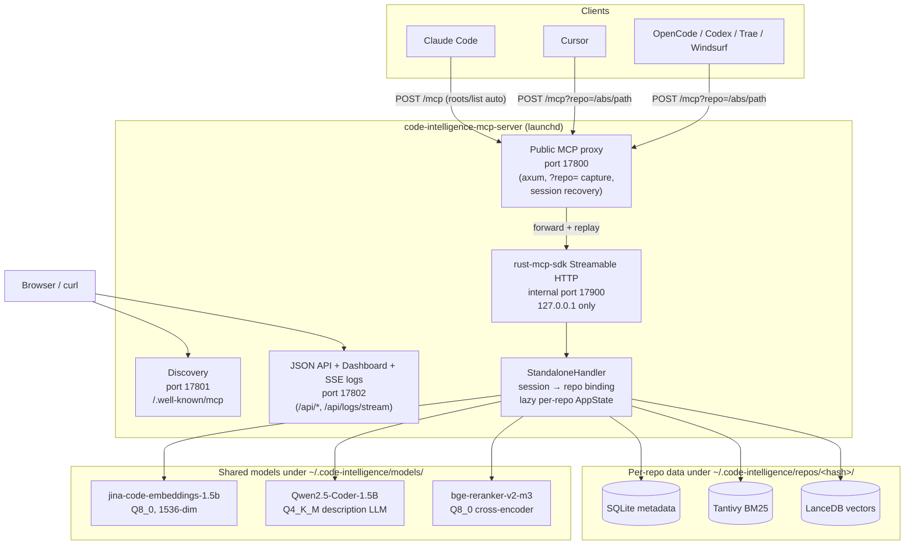

# Code Intelligence System Architecture

This document describes the architecture of the Code Intelligence MCP Server (v4.x). Since v4.0 the server runs as a single shared HTTP daemon managed by launchd; the v3 stdio-per-client transport and leader-election machinery have been removed. The daemon builds a local knowledge graph of every registered repo and exposes it through 32 MCP tools, a JSON API, and an embedded dashboard.

The long-term product boundary is the local code intelligence engine, not MCP itself. MCP is one adapter over the daemon. A first-class CLI and stable JSON contracts are the next durable interface layer; see [Interface Direction](docs/architecture/interface-direction.md).

## High-Level Overview

The daemon scans a repo's source files, extracts semantic symbols with Tree-Sitter, generates 1536-dim Matryoshka vector embeddings (jina-code-embeddings-1.5b, GGUF via llama.cpp + Metal GPU), builds a knowledge graph with PageRank scoring, and serves intelligent queries with query-aware context assembly. Two optional enrichment models run only when opted into: on-device natural-language descriptions (Qwen2.5-Coder-1.5B, `DESCRIPTIONS_ENABLED=1`) and cross-encoder reranking (bge-reranker-v2-m3, `RERANKER_ENABLED=1`), both via llama.cpp + Metal GPU.

All models run on-device; there are no cloud dependencies. By default only the embedding model loads at daemon start (shared across every MCP session, resident for queries). The description LLM and reranker are off by default — benchmarks (R005/R006) showed neither moved the judge score, and each adds setup cost (a multi-hour index-time backfill; GPU residency). When enabled: the description LLM is freed after each indexing pass; the reranker stays resident for queries.

## Runtime Topology


```mermaid
flowchart TB
  subgraph Clients
    direction LR
    CC[Claude Code]
    Cursor[Cursor]
    OC[OpenCode / Codex / Trae / Windsurf]
  end

  subgraph Daemon["code-intelligence-mcp-server (launchd)"]
    direction TB
    Proxy["Public MCP proxy<br/>port 17800<br/>(axum, ?repo= capture,<br/>session recovery)"]
    Disco["Discovery<br/>port 17801<br/>/.well-known/mcp"]
    API["JSON API + Dashboard + SSE logs<br/>port 17802<br/>(/api/*, /api/logs/stream)"]
    SDK["rust-mcp-sdk Streamable HTTP<br/>internal port 17900<br/>127.0.0.1 only"]
    Handler["StandaloneHandler<br/>session → repo binding<br/>lazy per-repo AppState"]

    Proxy -- "forward + replay" --> SDK
    SDK --> Handler
  end

  subgraph Storage["Per-repo data under ~/.code-intelligence/repos/&lt;hash&gt;/"]
    direction LR
    SQLite[(SQLite metadata)]
    Tantivy[(Tantivy BM25)]
    Lance[(LanceDB vectors)]
  end

  subgraph Models["Shared models under ~/.code-intelligence/models/"]
    direction LR
    Embed[jina-code-embeddings-1.5b<br/>Q8_0, 1536-dim]
    LLM[Qwen2.5-Coder-1.5B<br/>Q4_K_M description LLM]
    Rerank[bge-reranker-v2-m3<br/>Q8_0 cross-encoder]
  end

  CC -- "POST /mcp (roots/list auto)" --> Proxy
  Cursor -- "POST /mcp?repo=/abs/path" --> Proxy
  OC -- "POST /mcp?repo=/abs/path" --> Proxy

  Handler --> SQLite
  Handler --> Tantivy
  Handler --> Lance
  Handler --> Embed
  Handler --> LLM
  Handler --> Rerank

  Browser[Browser / curl] --> API
  Browser --> Disco
```

Every public port binds 127.0.0.1 only and rejects non-localhost `Origin` headers (DNS-rebinding defence). The internal SDK port (17900) is loopback-only.

## Interface Strategy

The daemon is the core system. It owns indexing, retrieval, graph traversal, local model lifecycle, background jobs, and repo registry state. Product interfaces should stay thin:

- **CLI**: first-class programmable surface for humans, agents, hooks, and CI. It should call the daemon and return stable JSON for `search`, `investigate`, `ask`, `hydrate`, and `repo-map`.
- **MCP**: compatibility adapter for MCP-capable coding clients. The long-term model-facing surface should become smaller and more composite so agents call one evidence-producing operation instead of chaining many specialist tools.
- **JSON API + dashboard**: local operational surface for status, repositories, sessions, jobs, logs, and scripting.

This keeps retrieval behavior consistent regardless of whether the caller is a shell command, an MCP client, or the dashboard.

### Session binding hierarchy

When a tool call lands on the daemon, the session needs a bound workspace. v4 tries four sources in order; first match wins.

1. **`?repo=/abs/path` URL query** (primary). The proxy captures the query parameter, pairs it with the `mcp-session-id` returned by the SDK, and stashes the pair in `PendingRepos` so `StandaloneHandler::resolve_state` promotes it before the first tool call.
2. **MCP `roots/list`** (opportunistic). Claude Code negotiates this automatically; most other clients do not implement it.
3. **`bind_workspace` tool call**: manual escape hatch for clients that cannot set query strings.
4. **Single-repo registry fallback**: when `repos/registry.json` has exactly one entry, unbound sessions auto-bind to it. Disables itself the moment a second repo is added.

If nothing binds, every tool call returns a JSON-RPC error pointing the user at all four options.

### Session resilience (v4.0.1+)

The proxy transparently recovers from upstream session expiry:

- The rust-mcp-sdk transport occasionally times out a session and returns the `-32016` "session expired" envelope. v4.0.1 detects this envelope, re-initialises the session against the SDK, replays the original request with the new session id, and forwards the second response to the client. The client sees a clean response with an updated `mcp-session-id`.
- Workspace bindings (`?repo=`, `roots/list`, `bind_workspace`) are preserved across recovery. The recovered session keeps the same repo without a re-bind round trip.
- Concurrent recoveries for the same stale session id are deduplicated so racing in-flight requests do not trigger duplicate upstream re-init storms.
- Successful recoveries are logged at INFO so operators can spot a recovering session via the dashboard's log panel or `~/.code-intelligence/logs/`.

The proxy keeps a `send_upstream_once` helper as the shared transport path for both the first attempt and the replay, and small 4xx JSON bodies are buffered so the recovery detector can inspect the error envelope before deciding whether to replay.

## Core Components

### 1. Indexing Pipeline (`src/indexer`)

#### File Scan (`src/indexer/scanner.rs`)

- Identifies relevant files using `INDEX_PATTERNS` globs
- Respects `.gitignore` and `EXCLUDE_PATTERNS`
- Parallel file discovery with configurable workers

#### Parsing (`src/indexer/parser.rs`)

- Tree-Sitter for language-agnostic AST parsing
- Error-tolerant: parsing continues on syntax errors
- Currently registered language ids: Rust, TypeScript (`.ts` and `.tsx` as separate dialects), JavaScript (`.js` / `.jsx`), Python, Go, Java, C (`.c` / `.h`), C++ (`.cpp` / `.cc` / `.cxx` / `.hpp`), Ruby, Kotlin (`.kt` / `.kts`), C# (`.cs`), Swift

#### Symbol Extraction (`src/indexer/extract/`)

Per-language extractors walk the AST to surface:

- **Symbols**: Functions, classes, structs, interfaces, methods, variables, exports
- **Edges**: `call`, `extends`, `implements`, `reads`, `writes`, `alias`
- **Decorators**: TS / JS decorators (`@Component`, `@Get`, …)
- **JSDoc**: `@param`, `@returns`, `@example`, `@deprecated`, `@throws`, `@see`, `@since`
- **TODOs**: TODO / FIXME comments with context
- **Framework patterns**: Express, Hono, Fastify, Elysia, FastAPI, Django, Spring, Actix, Axum, NestJS, NextJS, tRPC, Convex, Go frameworks, Ruby, Kotlin, Swift

#### PageRank Computation (`src/graph/pagerank.rs`)

Graph-based importance scoring over `call` and `reads` edges (default: 20 iterations, damping 0.85). Used as a structural ranking signal.

### 2. Embedding Engine (`src/embeddings`)

#### Embedding Model (`src/embeddings/llamacpp.rs`)

- Default: `jinaai/jina-code-embeddings-1.5b-GGUF` (Q8_0, ~1.5 GB)
- Native dimension: 1536, Matryoshka structure (truncate + L2-renormalize for smaller dims via `EMBEDDING_DIM`)
- Symmetric embeddings: queries and documents share the same space (no instruction prefix)
- llama.cpp with Metal GPU (`n_gpu_layers=99`); shared singleton across the daemon

#### Embedding Cache (`src/storage/cache.rs`)

- Content-addressed by file hash
- Persists across daemon restarts; only changed files re-embedded on refresh
- Toggle with `EMBEDDING_CACHE_ENABLED`

### 3. Description LLM (`src/llm`) — off by default

The description LLM enriches BM25 search by generating natural-language summaries for every indexed symbol, bridging the vocabulary gap between how users search ("auth handler") and how code is named (`authenticate_request`). It is **off by default** (`DESCRIPTIONS_ENABLED=1` to enable): the index-time backfill takes hours on a large repo and benchmarks (R005/R006) showed no judge benefit. The worker spawn is gated by `should_spawn_description_worker` in `src/session.rs`.

#### Backend (`src/llm/llamacpp.rs`)

- Default: `Qwen/Qwen2.5-Coder-1.5B-Instruct-GGUF` (Q4_K_M, ~1.0 GB)
- Override via `LLM_HF_REPO` / `LLM_HF_MODEL_FILE`
- llama.cpp + Metal GPU, all layers offloaded (`n_gpu_layers=99`)
- Greedy sampling, Qwen2.5 chat template (`AddBos::Never`)
- ~0.32 s per symbol on Apple Silicon; per-call `LlamaContext` (the type is `!Send`)

#### Pipeline

1. Parallel indexing produces a batch of new symbols.
2. The daemon loads the description LLM, generates a description per symbol, and writes:
   - **SQLite** `symbol_descriptions` keyed by `symbol_id` + `content_hash`
   - **Tantivy** text field via `expand_index_text` (BM25 enrichment)
3. After the batch the LLM is **freed** to release ~1.0 GB of RAM. The embedding model stays resident for queries.
4. Stale descriptions (content-hash mismatch after a code edit) are surfaced by `find_stale_descriptions` and regenerated on the next refresh.
5. On daemon start a background recovery task regenerates descriptions for symbols that lost their LLM enrichment (e.g. after a schema bump or LanceDB data loss).

### 4. Storage Engine (`src/storage`)

Per-repo storage lives under `~/.code-intelligence/repos/<sha256[:16]>/`. The hash is computed from the canonical absolute path the session bound to.

#### SQLite (`src/storage/sqlite/`)

Relational metadata storage with pooled connections:

- **Symbols**: id, name, kind, file path, range, export status, PageRank score
- **Edges**: `call`, `extends`, `implements`, `reads`, `writes`, `alias`
- **JSDoc / Decorators / TODOs**
- **Test links**: bidirectional test ↔ source mappings
- **Packages**: monorepo package detection
- **Symbol descriptions**: LLM output keyed by content hash
- **Index / search telemetry**, **learning** events

#### Tantivy (`src/storage/tantivy.rs`)

- BM25 ranking with n-gram tokenization
- Indexes symbol names, code text (comments stripped), morphological variants, concept tags, framework patterns, and LLM descriptions
- Schema is versioned (currently v21); a schema bump wipes the Tantivy index and forces a `refresh_index`
- Fuzzy search and exact identifier matching

#### LanceDB (`src/storage/vector.rs`)

- 1536-dim vector embeddings, cosine distance
- Configurable Matryoshka truncation via `EMBEDDING_DIM`
- Auto-recovery: if the LanceDB `data/` directory is lost (transactions / versions remain), the indexing pass on startup regenerates orphaned vectors

### 5. Retrieval Engine (`src/retrieval`)

#### Query Expansion (`src/retrieval/expansion/`)

- Synonyms: `auth → authentication`, `db → database`
- Acronyms: `id → identifier`, `req → request`
- Toggle via `SYNONYM_EXPANSION_ENABLED`, `ACRONYM_EXPANSION_ENABLED`

#### Query Decomposition (`src/retrieval/mod.rs`)

- Splits complex queries: `authentication and authorization → [authentication, authorization]`
- Sub-query coverage ensures each term contributes results

#### Hybrid Search with RRF (`src/retrieval/hybrid.rs`)

- Parallel calls to Tantivy (keyword), LanceDB (vector), and the graph (links)
- Reciprocal Rank Fusion: `1 / (k + rank)`, configurable `RRF_K` (default 60)
- Per-source weights: `RRF_KEYWORD_WEIGHT`, `RRF_VECTOR_WEIGHT`, `RRF_GRAPH_WEIGHT`

#### Cross-Encoder Reranking (`src/reranker/`) — off by default

- Default: `gpustack/bge-reranker-v2-m3-GGUF` (Q8_0, ~600 MB)
- BERT cross-encoder via llama.cpp + Metal GPU
- **Off by default** (`RERANKER_ENABLED=1` to enable); top-K reranking (default 20). Benchmarks (R006) measured it net-negative on judge score, so it does not ship on
- When enabled, loads in the background via `DeferredReranker` (HTTP server starts immediately; queries run BM25+vector until the model is ready), then stays resident alongside the embedding model
- `CachedReranker` memoises (query, doc) scores to avoid re-scoring duplicates

#### Ranking Signals (`src/retrieval/ranking/score.rs`)

Applied between RRF and reranking:

1. PageRank boost (configurable via `RANK_POPULARITY_WEIGHT`)
2. Test penalty (0.5x unless test intent; multi-layer detection)
3. Glue-code filtering (barrel files like `index.ts` deprioritised)
4. Directory semantics (`src` / `lib` boosted; `dist` / `build` / `node_modules` penalised)
5. Export boost (`RANK_EXPORTED_BOOST`)
6. Intent multipliers (Definition 1.5x, Schema 50-75x, Test multipliers, …)
7. JSDoc boost
8. Framework-pattern injection
9. Sub-query coverage
10. Edge expansion (high-ranking symbols pull in callers / type members)
11. File / kind diversification
12. Score-gap detection (drops trailing results when there is a >2.5x score drop)
13. Learning boost (off by default)
14. Same-package boost in monorepos
15. Final intent enforcement after expansion + diversification

#### Intent Detection (`src/retrieval/intent.rs`)

- `Intent::Definition`: "struct User", "class AuthService"
- `Intent::Callers`: "who calls login", "find callers"
- `Intent::Test`: "verify login", "test authentication"
- `Intent::Schema`: "User model", "schema definition"

### 6. Context Assembly (`src/retrieval/assembler/`)

- tiktoken-based token counting (default `o200k_base`), `MAX_CONTEXT_TOKENS=8192`
- BM25-style line relevance ranking keeps query-relevant lines within the token budget
- First sub-query is used for multi-query relevance; query hash is included in the cache key
- Formatting modes: Compact, Standard, Verbose

### 7. Graph Engine (`src/graph/`)

- **Call hierarchy** (`graph/calls.rs`): bidirectional `call` traversal
- **Type graph** (`graph/types.rs`): `extends`, `implements`, `alias`
- **Dependency graph** (`graph/dependencies.rs`): module-level imports / exports
- **Data flow** (`graph/dataflow.rs`): `reads` / `writes` tracing

### 8. Learning System (`src/learning/`)

- `report_selection` and `report_file_access` feed symbol- and file-affinity boosts
- Stored in SQLite; off by default (`LEARNING_ENABLED=false`)

### 9. Background Jobs (`src/jobs/`)

- Re-index jobs spawned by `refresh_index`, `POST /api/repos/:id/reindex`, and the dashboard's "Re-index" button
- Tracked in an in-memory registry surfaced at `GET /api/jobs` (15-minute retention for finished jobs)
- A panic watchdog converts unexpected unwinds into failed-job records so the dashboard reports the error instead of hanging on "running"

### 10. Metrics (`src/metrics/`)

Prometheus metrics on port 9090 (override via `METRICS_PORT`):

- `search_duration_ms`, `keyword_ms`, `vector_ms`, `reranker_ms`
- `symbols_indexed`, `files_indexed`
- `embedding_cache_hit_rate`

## JSON API + Dashboard

Port `mcp_port + 2` (default **17802**) hosts both the embedded dashboard and a structured JSON API. Every endpoint binds 127.0.0.1 and enforces same-origin.

| Method | Path | Returns |
|---|---|---|
| `GET` | `/api/version` | daemon version, uptime |
| `GET` | `/api/status` | daemon overview (ports, model state) |
| `GET` | `/api/repos` | every registered repo with last-accessed time |
| `GET` | `/api/repos/:id` | per-repo metadata + symbol / edge / description stats |
| `POST` | `/api/repos/:id/reindex` | spawn a background re-index, returns `job_id` |
| `DELETE` | `/api/repos/:id` | drop the index, registry entry, and on-disk data dir |
| `GET` | `/api/sessions` | bound + connected MCP sessions, with TTL state |
| `GET` | `/api/jobs` | running + recently-finished jobs (≤15 min) |
| `GET` | `/api/logs/stream` | SSE stream of log lines |
| `POST` | `/api/query/ask` | CLI-facing `ask_code` wrapper with structured envelope |
| `POST` | `/api/query/search` | CLI-facing `search_code` wrapper with structured envelope |
| `POST` | `/api/query/investigate` | CLI-facing `investigate` wrapper with structured envelope |
| `POST` | `/api/query/hydrate` | CLI-facing `hydrate_symbols` wrapper with structured envelope |
| `POST` | `/api/query/repo-map` | CLI-facing compact project map with structured envelope |

The dashboard renders these surfaces with a repo list (expand for stats, inline re-index / delete), MCP sessions card (connected vs bound, 5-minute inactivity TTL), jobs panel (status badge, live elapsed, success summary or error text), and a live log tail with pause / clear / level filter. A theme toggle (system / light / dark) lives in the header.

## Discovery

Port `mcp_port + 1` (default **17801**) hosts `/.well-known/mcp` advertising the transport type (`streamable-http`) and the MCP URL. Used by clients that auto-discover MCP servers on `localhost`.

## Data Flow: Complete Search Request

1. **Input**: `User: "authentication and authorization"`
2. **Expansion + decomposition**: `auth → authentication`; split into `[authentication, authorization]`
3. **Hybrid search per sub-query**: Tantivy BM25, LanceDB vector, graph link traversal in parallel
4. **Rank fusion**: per-source RRF, then sub-query merge
5. **Cross-encoder reranking** _(only if `RERANKER_ENABLED=1`)_: bge-reranker-v2-m3 on top-20
6. **Signal application**: PageRank, test penalty, intent multipliers, edge expansion, score-gap, etc.
7. **Context assembly**: token-budgeted, query-aware line selection, JSDoc + metadata
8. **Response**: ranked hits + optional context bundle + query explanation

## Performance Characteristics

### Indexing

- **First-launch model download**: ~1.5 GB by default (embedding only). +1.0 GB if `DESCRIPTIONS_ENABLED=1`, +600 MB if `RERANKER_ENABLED=1` (~3.2 GB with both)
- **Initial index**: ~2-3 min for 10k files (parsing + embedding); when descriptions are enabled, generation adds ~0.32 s / symbol on top (the multi-hour backfill on large repos that motivated the off-by-default)
- **Re-index**: ~30-60 s with the embedding cache; only changed files re-embedded and re-described
- **Incremental (watch mode)**: ~100-500 ms per changed file

### Search Latency

- **Cold**: ~500-1000 ms (first query, no cache)
- **Warm**: ~50-200 ms (cached embeddings, indices loaded)
- Components: Tantivy 10-50 ms, LanceDB 20-100 ms, cross-encoder reranker 20-50 ms (top-20)

### Storage

- **SQLite**: ~1-5 MB per 10k symbols (more when LLM descriptions are populated)
- **Tantivy**: ~50-200 MB per 10k symbols (LLM descriptions roughly double the text field size)
- **LanceDB**: ~150-700 MB per 10k symbols (1536-dim vectors)
- **Embedding cache**: ~200 MB per 10k symbols

## Data Storage Layout

```
~/.code-intelligence/
├── models/                                  # Shared across all repos (~1.5 GB default; ~3.2 GB with both opt-ins)
│   ├── jina-code-embeddings-1.5b-gguf/      # Embedding model, ~1.5 GB Q8_0 (default)
│   ├── qwen2.5-coder-1.5b-gguf/             # Description LLM, ~1.0 GB Q4_K_M (only if DESCRIPTIONS_ENABLED=1)
│   └── bge-reranker-v2-m3-gguf/             # Cross-encoder reranker, ~600 MB Q8_0 (only if RERANKER_ENABLED=1)
├── logs/
│   └── server.log
├── server.toml                              # Standalone config (optional)
└── repos/
    ├── registry.json                        # Maps repo paths → hash dirs
    └── <sha256[:16]>/                       # Per-repo data
        ├── code-intelligence.db             # SQLite (symbols, edges, metadata, descriptions)
        ├── tantivy-index/                   # BM25 full-text index (LLM-enriched)
        └── vectors/                         # LanceDB vector embeddings (1536-dim)
```

The same canonical repo path always maps to the same hash, so re-binding the same workspace across daemon restarts reuses the existing index. `registry.json` is the shared source of truth used by the dashboard, the JSON API, and `StandaloneHandler::resolve_state`.

## MCP Tools (32 total)

See [README.md](README.md) for the complete tool list with descriptions. Categories:

- **Search & Navigation**: `search_code`, `get_definition`, `find_references`, `get_call_hierarchy`, `get_type_graph`, `explore_dependency_graph`, `get_file_symbols`, `get_usage_examples`, `get_context_bundle`
- **Analysis**: `find_affected_code`, `predict_impact`, `trace_data_flow`, `find_similar_code`, `get_similarity_cluster`, `find_duplicates`, `find_dead_code`, `explain_search`, `summarize_file`, `get_module_summary`
- **Testing, Frameworks & Description Lifecycle**: `find_tests_for_symbol`, `search_todos`, `search_decorators`, `search_framework_patterns`, `find_undocumented_symbols`, `find_stale_descriptions`
- **Cross-Repo**: `search_across_repos`, `explore_cross_repo_dependencies`
- **Composite & Conversational**: `ask_code`, `investigate`, `plan_code_investigation`
- **Index Management & Learning**: `bind_workspace`, `hydrate_symbols`, `report_selection`, `report_file_access`, `refresh_index`, `get_index_stats`

The `ask_code` tool runs `investigate` server-side and returns the verified `evidence[]` array; the local-LLM prose synthesis path is opt-in via `ASK_CODE_LLM_SYNTHESIS=1` (default off since v3.3 after evidence-only mode improved agent grounding).

## Configuration

Configuration priority: **CLI flags > environment variables > `~/.code-intelligence/server.toml` > defaults.**

The `server.toml` file is optional; the daemon falls back to defaults when it is absent. Key environment variables:

- `EMBEDDINGS_BACKEND`: `llamacpp` (default) or `hash` (testing)
- `EMBEDDINGS_DEVICE`: `metal` (default) or `cpu`
- `MAX_CONTEXT_TOKENS`: `8192` (default)
- `RERANKER_ENABLED`: `true` (default)
- `LEARNING_ENABLED`: `false` (default)
- `RRF_ENABLED`: `true` (default)
- `ASK_CODE_LLM_SYNTHESIS`: unset (default); opt back into local-LLM prose in `ask_code`
- `LLM_HF_REPO`, `LLM_HF_MODEL_FILE`: override the description LLM repo and file
- `WATCH_MODE`, `INDEX_PATTERNS`, `EXCLUDE_PATTERNS`

See `README.md` for the full table.

## Technology Stack

- **Language**: Rust 2021
- **Parsing**: Tree-Sitter (Rust, TypeScript / TSX, JavaScript, Python, Go, Java, C, C++, Ruby, Kotlin, C#, Swift)
- **Storage**: SQLite (rusqlite, pooled), Tantivy (BM25), LanceDB (vectors)
- **Embeddings**: jina-code-embeddings-1.5b Q8_0, 1536-dim Matryoshka (GGUF via llama-cpp-2 + Metal GPU)
- **Description LLM**: Qwen2.5-Coder-1.5B-Instruct Q4_K_M (GGUF via llama-cpp-2 + Metal GPU)
- **Reranker**: bge-reranker-v2-m3 Q8_0 cross-encoder (GGUF via llama-cpp-2 + Metal GPU), enabled by default
- **Tokenization**: tiktoken (`o200k_base`)
- **HTTP**: axum (proxy, JSON API, dashboard, SSE)
- **Protocol**: Model Context Protocol via `rust-mcp-sdk 0.8.1` (Streamable HTTP only)
- **Process supervision**: launchd (`com.iceinvein.code-intelligence.plist`) or `brew services`
- **Path safety**: camino (UTF-8 typed paths)
- **Metrics**: Prometheus (port 9090, configurable)

## Platform

macOS only (Apple Silicon). The embedding, description, and reranker models are GGUF Metal-accelerated builds. The `launchctl bootstrap` API used by the `install` subcommand requires macOS 13+.
