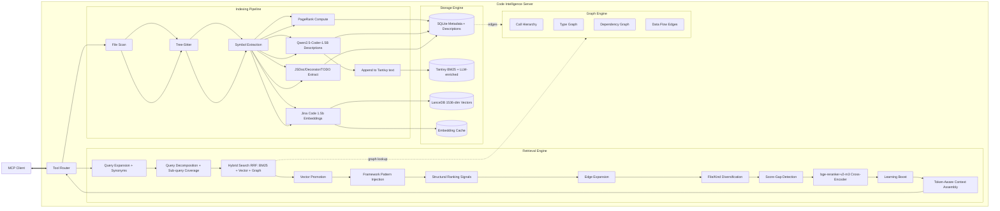

# Code Intelligence System Architecture

This document outlines the architecture of the Code Intelligence MCP Server (v2.x). The system provides fast, semantic, and structure-aware code navigation for LLM agents by building a local knowledge graph of the codebase with advanced retrieval and ranking capabilities.

## High-Level Overview

The system operates as a local indexing and retrieval engine. It scans the user's codebase, extracts semantic symbols (classes, functions, etc.), generates 1536-dimensional vector embeddings using jina-code-embeddings-1.5b (llama.cpp + Metal GPU), generates natural-language descriptions for every symbol using Qwen2.5-Coder-1.5B (llama.cpp + Metal GPU) to enrich BM25 keyword search, builds a knowledge graph with PageRank scoring, and provides intelligent search with cross-encoder reranking (bge-reranker-v2-m3) and query-aware context assembly.

All three ML models run on-device via llama.cpp on Metal GPU. There are no cloud dependencies.

## System Architecture Diagram


```mermaid
flowchart LR
  Client[MCP Client] <==> Tools

  subgraph Server [Code Intelligence Server]
    direction TB
    Tools[Tool Router]

    subgraph Indexer [Indexing Pipeline]
      direction TB
      Scan[File Scan] --> Parse[Tree-Sitter]
      Parse --> Extract[Symbol Extraction]
      Extract --> PageRank[PageRank Compute]
      Extract --> Embed[Jina Code 1.5b Embeddings]
      Extract --> Describe[Qwen2.5-Coder-1.5B Descriptions]
      Extract --> Meta[JSDoc/Decorator/TODO Extract]
      Describe --> EnrichBM25[Append to Tantivy text]
    end

    subgraph Storage [Storage Engine]
      direction TB
      SQLite[(SQLite Metadata + Descriptions)]
      Tantivy[(Tantivy BM25 + LLM-enriched)]
      Lance[(LanceDB 1536-dim Vectors)]
      Cache[(Embedding Cache)]
    end

    subgraph Retrieval [Retrieval Engine]
      direction TB
      QueryExpand[Query Expansion + Synonyms]
      Decompose[Query Decomposition + Sub-query Coverage]
      Hybrid[Hybrid Search RRF: BM25 + Vector + Graph]
      Promote[Vector Promotion]
      Framework[Framework Pattern Injection]
      Signals[Structural Ranking Signals]
      EdgeExpand[Edge Expansion]
      Diversify[File/Kind Diversification]
      ScoreGap[Score-Gap Detection]
      Rerank[bge-reranker-v2-m3 Cross-Encoder]
      Learn[Learning Boost]
      Context[Token-Aware Context Assembly]
    end

    subgraph Graph [Graph Engine]
      direction TB
      CallGraph[Call Hierarchy]
      TypeGraph[Type Graph]
      DepGraph[Dependency Graph]
      DataFlow[Data Flow Edges]
    end

    %% Index Flow
    Tools --> Scan
    Scan --> Parse
    Parse --> Extract
    Extract --> PageRank
    Extract --> Embed
    Extract --> Describe
    Extract --> Meta
    PageRank --> SQLite
    Embed --> Lance
    Embed --> Cache
    Describe --> SQLite
    EnrichBM25 --> Tantivy
    Meta --> SQLite

    %% Query Flow
    Tools --> QueryExpand
    QueryExpand --> Decompose
    Decompose --> Hybrid
    Hybrid --> Promote
    Promote --> Framework
    Framework --> Signals
    Signals --> EdgeExpand
    EdgeExpand --> Diversify
    Diversify --> ScoreGap
    ScoreGap --> Rerank
    Rerank --> Learn
    Learn --> Context
    Context --> Tools

    %% Graph Integration
    SQLite -.->|edges| Graph
    Hybrid -.->|graph lookup| Graph
  end
```

## Core Components

### 1. Indexing Pipeline (`src/indexer`)

The indexing pipeline transforms raw source code into structured, searchable data.

#### File Scan (`src/indexer/scanner.rs`)

- Identifies relevant files using glob patterns
- Respects `.gitignore` and exclude patterns
- Multi-repo support via `REPO_ROOTS` configuration
- Parallel file discovery with configurable workers

#### Parsing (`src/indexer/parser.rs`)

- Uses **Tree-Sitter** for language-agnostic AST parsing
- Supports 9 languages: Rust, TypeScript, JavaScript, Python, Go, Java, C, C++
- Error-tolerant parsing continues on syntax errors

#### Symbol Extraction (`src/indexer/extract/`)

Language-specific extractors walk the AST to identify:

- **Symbols**: Functions, classes, structs, interfaces, methods, variables
- **Metadata**: Range, visibility, modifiers, documentation
- **Relationships**: Calls, extends, implements, reads, writes
- **Decorators**: TypeScript/JavaScript decorators (@Component, @Get, etc.)
- **JSDoc**: @param, @returns, @example, @deprecated, @throws, @see, @since
- **TODOs**: TODO and FIXME comments with context

#### PageRank Computation (`src/graph/pagerank.rs`)

- Graph-based importance scoring for all symbols
- Iterative algorithm (default: 20 iterations, damping: 0.85)
- Identifies "central" components that are heavily referenced
- Used as ranking signal for search results

### 2. Embedding Engine (`src/embeddings`)

#### Embedding Model (`src/embeddings/llamacpp.rs`)

- **Default model**: `jinaai/jina-code-embeddings-1.5b-GGUF` (Q8_0 quantization, ~1.5 GB)
- **Native dimension**: 1536 (Matryoshka representation: the first N dimensions retain meaningful structure, so embeddings can be truncated and L2-renormalized)
- **Symmetric** embeddings: queries and documents share the same space (no instruction prefix needed, unlike BGE asymmetric models)
- llama.cpp runtime with Metal GPU acceleration (`n_gpu_layers=99`)
- Batch processing with configurable batch size
- Override dimension via `EMBEDDING_DIM` for evaluating models with different native dimensions
- `TruncatingEmbedder` decorator caps output at a smaller dimension when needed

#### Embedding Cache (`src/storage/cache.rs`)

- Persistent caching of generated embeddings
- Content-addressed by file hash
- Dramatically speeds up re-indexing
- Configurable via `EMBEDDING_CACHE_ENABLED`

### 3. Description LLM (`src/llm`)

The description LLM enriches BM25 search by generating natural-language summaries for every indexed symbol, bridging the vocabulary gap between how users search ("auth handler") and how code is named (`authenticate_request`).

#### LLM Backend (`src/llm/llamacpp.rs`)

- **Default model**: `Qwen/Qwen2.5-Coder-1.5B-Instruct-GGUF` (Q4_K_M quantization, ~1.0 GB)
- llama.cpp runtime with Metal GPU acceleration (`n_gpu_layers=99`, all 29 layers offloaded)
- Greedy sampling with `AddBos::Never` (Qwen2.5 chat template handles BOS)
- ~0.32s per symbol generation throughput on Apple Silicon
- Per-call `LlamaContext` creation (the type is `!Send`)

#### Description Pipeline

1. After parallel indexing produces a batch of new symbols, the LLM is loaded and generates a description for each
2. Descriptions are appended to the symbol's Tantivy text field via `expand_index_text` (BM25 enrichment)
3. Descriptions are also stored in SQLite (`symbol_descriptions` table) keyed by `symbol_id` and `content_hash`
4. After generation completes the LLM is **freed** to release ~1.0 GB of RAM; the embedding model and reranker stay resident for queries
5. Stale descriptions (content hash mismatch after a code edit) are detected by `find_stale_descriptions` and regenerated on the next refresh
6. Background recovery task on startup regenerates descriptions for symbols that lost their LLM enrichment (e.g. after schema bump or LanceDB data loss)

#### Storage Coordination

- In standalone HTTP mode: a single instance generates descriptions for each repo
- In stdio mode: leader election via file lock (`src/leader.rs`) ensures only one process per repo loads the LLM and writes descriptions; followers never load it

### 4. Storage Engine (`src/storage`)

Multi-modal storage approach optimized for different query patterns:

#### SQLite (`src/storage/sqlite/`)

Relational metadata storage:

- **Symbols**: ID, name, kind, file path, range, export status, PageRank score
- **Edges**: Relationships (calls, extends, implements, reads, writes)
- **JSDoc**: Documentation entries with tags
- **Decorators**: Decorator metadata with types
- **TODOs**: TODO/FIXME comments
- **Test Links**: Bidirectional test-to-source mappings
- **Packages**: Package detection for monorepo scoring
- **Learning**: User selection feedback

#### Tantivy (`src/storage/tantivy.rs`)

- High-performance full-text search engine
- BM25 ranking with n-gram tokenization
- Indexes symbol names, code text (comments stripped), morphological variants, concept tags, framework patterns, and **LLM-generated descriptions**
- Schema is versioned (currently v21); a schema bump wipes the Tantivy index and forces a `refresh_index`
- Fuzzy search and exact identifier matching
- Optimized for keyword queries

#### LanceDB (`src/storage/vector.rs`)

- Vector database for semantic similarity search
- Stores 1536-dim jina-code-embeddings-1.5b embeddings (configurable truncation via `EMBEDDING_DIM`)
- Cosine distance for similarity scoring
- Configurable search limit
- Auto-recovery: if LanceDB `data/` directory is lost (transactions/versions remain), the embedding-generation pass on startup regenerates orphaned vectors

### 5. Retrieval Engine (`src/retrieval`)

The heart of the system with advanced search and ranking capabilities.

#### Query Expansion (`src/retrieval/expansion/`)

- **Synonym Expansion**: "auth" → "authentication", "db" → "database"
- **Acronym Expansion**: "id" → "identifier", "req" → "request"
- Configurable via `SYNONYM_EXPANSION_ENABLED` and `ACRONYM_EXPANSION_ENABLED`

#### Query Decomposition (`src/retrieval/mod.rs`)

- Splits complex queries: "authentication and authorization" → ["authentication", "authorization"]
- Enables multi-query search for better coverage
- Results merged via Reciprocal Rank Fusion (RRF)

#### Hybrid Search with RRF (`src/retrieval/hybrid.rs`)

- Parallel queries to Tantivy (keyword), LanceDB (vector), and graph (links)
- **Reciprocal Rank Fusion**: Statistically optimal rank combination
  - Formula: `1 / (k + rank)` for each source
  - Configurable `RRF_K` (default: 60.0)
  - Per-source weights: `RRF_KEYWORD_WEIGHT`, `RRF_VECTOR_WEIGHT`, `RRF_GRAPH_WEIGHT`

#### Cross-Encoder Reranking (`src/reranker/`)

- **Default model**: `gpustack/bge-reranker-v2-m3-GGUF` (Q8_0, ~600 MB)
- BERT-based cross-encoder run via llama.cpp + Metal GPU
- **Enabled by default** (`reranker_enabled: true`); disable via `RERANKER_ENABLED=false`
- Top-K reranking (default: 20) to balance quality and latency
- Query-document relevance scoring; results are wrapped in a `CachedReranker` to avoid re-scoring identical (query, doc) pairs
- Stays resident in memory alongside the embedding model

#### Ranking Signals (`src/retrieval/ranking/score.rs`)

Sophisticated scoring pipeline with multiple signals applied between RRF and reranking:

1. **PageRank Boost**: Graph-based importance (0.05 × score by default, tunable via `RANK_POPULARITY_WEIGHT`)
2. **Test Penalty**: 0.5x multiplier unless test intent (multi-layer detection: file path, symbol name, AST `#[test]` / `mod tests`)
3. **Glue Code Filtering**: penalty for `index.ts`-style barrel files
4. **Directory Semantics**: `dist`, `build`, `node_modules` heavily penalized; `src`, `lib`, `app` boosted
5. **Export Boost**: `RANK_EXPORTED_BOOST` for exported symbols (public API surface)
6. **Intent Multipliers**: Definitions 1.5x, Schema 50-75x, Test multipliers, etc.
7. **JSDoc Boost**: documented symbols ranked higher
8. **Framework-pattern injection**: routes, middleware, decorators surfaced alongside symbol matches
9. **Sub-query coverage**: multi-term queries ensure each sub-query has at least 2 matching results
10. **Edge expansion**: high-ranking symbols pull in structurally related code (callers, type members) with parent-derived scores stripped of intent multipliers
11. **File/kind diversification**: caps how many results come from one file or one kind
12. **Score-gap detection**: drops trailing results when there's a >2.5x score drop from the previous result (configurable ratio threshold 0.4)
13. **Learning Boost**: User selection feedback (optional, off by default)
14. **Package Boost**: Same-package boost in monorepos
15. **Final intent enforcement**: applied after expansion + diversification so edge-expanded hits get correct test/schema treatment

#### Intent Detection (`src/retrieval/intent.rs`)

Query understanding for specialized ranking:

- `Intent::Definition`: "struct User", "class AuthService"
- `Intent::Callers`: "who calls login", "find callers"
- `Intent::Test`: "verify login", "test authentication"
- `Intent::Schema`: "User model", "schema definition"

### 6. Context Assembly (`src/retrieval/assembler/`)

Token-aware context formatting with query-aware truncation.

#### Token Budgeting (`src/retrieval/assembler/formatting.rs`)

- tiktoken-based token counting (default: `o200k_base`)
- Configurable via `MAX_CONTEXT_TOKENS` (default: 8192)
- Respects token limits, not byte limits

#### Query-Aware Truncation (`src/retrieval/assembler/formatting.rs`)

- **BM25-style relevance scoring**: Ranks lines by query relevance
- Keeps query-relevant lines within token budget
- First sub-query used for multi-query relevance
- Query hash included in cache key for freshness

#### Formatting Modes (`src/retrieval/assembler/mod.rs`)

- **Compact**: Minimal formatting, max code density
- **Standard**: Balanced formatting with metadata
- **Verbose**: Full context with all metadata

### 7. Graph Engine (`src/graph/`)

Knowledge graph for code relationship understanding.

#### Call Hierarchy (`src/graph/calls.rs`)

- Navigates `call` edges bidirectionally
- Upstream: Find all callers of a function
- Downstream: Find all functions called by a symbol

#### Type Graph (`src/graph/types.rs`)

- Navigates `extends`, `implements`, `alias` edges
- Inheritance hierarchy exploration
- Type alias resolution

#### Dependency Graph (`src/graph/dependencies.rs`)

- Module-level dependency tracking
- Upstream: Find all dependencies
- Downstream: Find all dependents

#### Data Flow (`src/graph/dataflow.rs`)

- Tracks `reads` and `writes` edges
- Variable usage tracing
- Impact analysis for changes

### 8. Learning System (`src/learning/`)

Optional adaptive ranking based on user feedback.

#### Selection Tracking (`src/learning/tracker.rs`)

- Records user selections via `report_selection` tool
- Tracks symbol-level and file-level affinity
- Stored in SQLite for persistence

#### Personalization (`src/retrieval/ranking/learning.rs`)

- Boosts previously selected symbols (configurable)
- File affinity boosting for frequent access
- Disabled by default (`LEARNING_ENABLED=false`)

### 9. Metrics (`src/metrics/`)

Prometheus metrics for observability:

- Search latency: `search_duration_ms`
- Component timing: `keyword_ms`, `vector_ms`, `reranker_ms`
- Index stats: `symbols_indexed`, `files_indexed`
- Cache performance: `embedding_cache_hit_rate`

Exposes on port 9090 (configurable via `METRICS_PORT`).

## Data Flow: Complete Search Request

### 1. Query Input

```
User: "authentication and authorization"
```

### 2. Query Expansion & Decomposition

- Expand synonyms: "auth" → "authentication"
- Decompose: ["authentication", "authorization"]

### 3. Parallel Hybrid Search (per sub-query)

- **Tantivy**: BM25 keyword search for "authentication"
- **LanceDB**: Vector similarity for "authentication"
- **Graph**: Link traversal for related symbols

### 4. Rank Fusion

- Combine results from all sources using RRF
- Merge sub-queries using unified RRF
- First sub-query used for primary ranking

### 5. Cross-Encoder Reranking

- Deep learning model re-scores top 20 results
- Precision tuning of result order

### 6. Signal Application

- Apply PageRank, test penalty, directory semantics
- Apply intent-based boosts
- Apply learning boosts (if enabled)
- Apply JSDoc and package boosts

### 7. Context Assembly

- Select top results within token budget
- Fetch full symbol definitions
- Apply query-aware truncation to keep relevant lines
- Format with JSDoc examples and metadata

### 8. Response

```json
{
  "results": [
    {
      "symbol": "AuthService",
      "file": "src/auth/service.ts",
      "relevance_score": 0.95,
      "context": "..."
    }
  ],
  "query_explanation": {
    "original": "authentication and authorization",
    "decomposed": ["authentication", "authorization"],
    "intent": "standard"
  }
}
```

## MCP Tools (32 Total)

See README.md for the complete tool list with descriptions. Key categories:

### Core Search & Navigation

- `search_code`, `get_definition`, `find_references`
- `get_call_hierarchy`, `get_type_graph`, `explore_dependency_graph`
- `get_file_symbols`, `get_usage_examples`, `get_context_bundle`

### Advanced Analysis

- `find_affected_code`, `predict_impact` (combines structural deps with git co-change history)
- `trace_data_flow`, `find_similar_code`, `get_similarity_cluster`
- `find_duplicates`, `find_dead_code`
- `explain_search`, `summarize_file`, `get_module_summary`

### Testing, Frameworks & Description Lifecycle

- `find_tests_for_symbol`, `search_todos`, `search_decorators`, `search_framework_patterns`
- `find_undocumented_symbols`, `find_stale_descriptions` (LLM description lifecycle)

### Cross-Repo (standalone mode only)

- `search_across_repos`, `explore_cross_repo_dependencies`

### Index Management & Learning

- `hydrate_symbols`, `report_selection`, `report_file_access`
- `refresh_index`, `get_index_stats`

## Performance Characteristics

### Indexing

- **First-launch model download**: ~3.2 GB (embedding 1.5 GB + LLM 1.0 GB + reranker 600 MB)
- **Initial Index**: ~2-3 min for 10k files (parsing + embedding); description generation adds ~0.32s/symbol on top
- **Re-index**: ~30-60 sec with cache (parallel workers); only changed files re-embedded and re-described
- **Incremental**: ~100-500 ms per changed file (watch mode)

### Search Latency

- **Cold Search**: ~500-1000 ms (first query, no cache)
- **Warm Search**: ~50-200 ms (cached embeddings, indices loaded)
- **Components**:
  - Tantivy: 10-50 ms
  - LanceDB: 20-100 ms
  - Cross-encoder reranker: 20-50 ms (top-20)

### Storage

- **SQLite**: ~1-5 MB per 10k symbols (more if LLM descriptions are populated)
- **Tantivy**: ~50-200 MB per 10k symbols (LLM descriptions roughly double the text-field size)
- **LanceDB**: ~150-700 MB per 10k symbols (1536-dim vectors)
- **Cache**: ~200 MB per 10k symbols (embeddings)

## Data Storage Layout

Both embedded (stdio) and standalone (HTTP) modes use the same centralized storage under `~/.code-intelligence/`. Each repo gets an isolated data directory derived from a deterministic 16-character SHA256 hash of its absolute path:

```text
~/.code-intelligence/
├── models/                                  # Shared across all repos (~3.2 GB total)
│   ├── jina-code-embeddings-1.5b-gguf/      # Embedding model, ~1.5 GB Q8_0
│   ├── qwen2.5-coder-1.5b-gguf/             # Description LLM, ~1.0 GB Q4_K_M
│   └── bge-reranker-v2-m3-gguf/             # Cross-encoder reranker, ~600 MB Q8_0
├── logs/
│   └── server.log
├── server.toml              # Standalone config (optional)
└── repos/
    ├── registry.json        # Maps repo paths → hash dirs
    └── <sha256[:16]>/       # Per-repo data
        ├── code-intelligence.db  # SQLite (symbols, edges, metadata, LLM descriptions)
        ├── tantivy-index/        # BM25 full-text index (LLM-enriched)
        └── vectors/              # LanceDB vector embeddings (1536-dim)
```

The same repo always maps to the same hash, so embedded and standalone modes share index data. The `repos/registry.json` file tracks registered repos for discovery by the standalone mode's session manager.

## Deployment Modes

### Embedded Mode (stdio)

The default mode: each MCP client spawns its own server process over stdio transport. The server reads `BASE_DIR`, auto-derives the per-repo data directory, and registers the repo in the shared registry. Suitable for single-client setups.

### Standalone Mode (HTTP)

A long-lived HTTP server that multiple MCP clients connect to via Streamable HTTP transport. The embedding model is loaded once and shared across all sessions. Each client session is bound to its workspace root via the MCP `roots` capability. Configured via `~/.code-intelligence/server.toml`.

## Configuration

See README.md for complete environment variable reference. Key settings:

- `llamacpp` (default) or `hash` (testing)
- `EMBEDDINGS_DEVICE`: `cpu`, `metal`
- `MAX_CONTEXT_TOKENS`: `8192` (default)
- `LEARNING_ENABLED`: `false` (default)
- `RRF_ENABLED`: `true` (default)
- `PARALLEL_WORKERS`: `1` (default, for SQLite)
- `REPO_ROOTS`: Multi-repo support

## Technology Stack

- **Language**: Rust 2021
- **Parsing**: Tree-Sitter (Rust, TypeScript, JavaScript, Python, Go, Java, C, C++)
- **Storage**: SQLite (rusqlite), Tantivy (BM25), LanceDB (vectors)
- **Embeddings**: jina-code-embeddings-1.5b Q8_0, 1536-dim Matryoshka (GGUF via llama-cpp-2 + Metal GPU)
- **Description LLM**: Qwen2.5-Coder-1.5B-Instruct Q4_K_M (GGUF via llama-cpp-2 + Metal GPU)
- **Reranker**: bge-reranker-v2-m3 Q8_0 cross-encoder (GGUF via llama-cpp-2 + Metal GPU), enabled by default
- **Tokenization**: tiktoken (o200k_base)
- **Protocol**: Model Context Protocol via `rust-mcp-sdk 0.8.1` (stdio + Streamable HTTP)
- **Path safety**: camino (UTF-8 typed paths), dunce (Windows UNC normalization)
- **Metrics**: Prometheus (port 9090, configurable)
