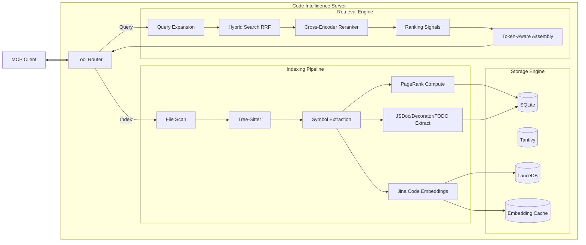

# Code Intelligence MCP Server

> **Semantic search and code navigation for LLM agents.**

[](https://www.npmjs.com/package/@iceinvein/code-intelligence-mcp)
[](LICENSE)
[](https://modelcontextprotocol.io)

---

This server indexes your codebase locally to provide **fast, semantic, and structure-aware** code navigation to tools like OpenCode, Trae, and Cursor.

## Why Use This Server?

Unlike basic text search, this server builds a local knowledge graph to understand your code.

* 🔍 **Advanced Hybrid Search**: Combines **Tantivy** (keyword BM25) + **LanceDB** (semantic vector) + **Jina Code embeddings** (768-dim code-specific model) with Reciprocal Rank Fusion (RRF).
* 🎯 **Cross-Encoder Reranking**: Always-on ORT-based reranker for precision result ranking.
* 🧠 **Smart Context Assembly**: Token-aware budgeting with query-aware truncation that keeps relevant lines within context limits.
* 📊 **PageRank Scoring**: Graph-based symbol importance scoring that identifies central, heavily-used components.
* 🎓 **Learns from Feedback**: Optional learning system that adapts to user selections over time.
* 🚀 **Production First**: Ranking heuristics prioritize implementation code over tests and glue code (`index.ts`).
* 🔗 **Multi-Repo Support**: Index and search across multiple repositories/monorepos simultaneously.
* ⚡ **Fast & Local**: Written in **Rust**. Uses Metal GPU acceleration on macOS. Parallel indexing with persistent caching.

---

## Quick Start

Runs directly via `npx` without requiring a local Rust toolchain.

### OpenCode / Trae

Add to your `opencode.json` (or global config):

```json
{
  "mcp": {
    "code-intelligence": {
      "type": "local",
      "command": ["npx", "-y", "@iceinvein/code-intelligence-mcp"],
      "enabled": true
    }
  }
}
```

*The server will automatically download the AI model (~300MB) and index your project in the background.*

---

## Capabilities

Available tools for the agent (19 tools total):

### Core Search & Navigation

| Tool                       | Description                                                                                                                                                             |
| :------------------------- | :---------------------------------------------------------------------------------------------------------------------------------------------------------------------- |
| `search_code`              | **Primary Search.** Finds code by meaning ("how does auth work?") or structure ("class User"). Supports query decomposition (e.g., "authentication and authorization"). |
| `get_definition`           | Retrieves the full definition of a specific symbol with disambiguation support.                                                                                         |
| `find_references`          | Finds all usages of a function, class, or variable.                                                                                                                     |
| `get_call_hierarchy`       | Specifies upstream callers and downstream callees.                                                                                                                      |
| `get_type_graph`           | Explores inheritance (extends/implements) and type aliases.                                                                                                             |
| `explore_dependency_graph` | Explores module-level dependencies upstream or downstream.                                                                                                              |
| `get_file_symbols`         | Lists all symbols defined in a specific file.                                                                                                                           |
| `get_usage_examples`       | Returns real-world examples of how a symbol is used in the codebase.                                                                                                    |

### Advanced Analysis

| Tool                     | Description                                                                               |
| :----------------------- | :---------------------------------------------------------------------------------------- |
| `explain_search`         | Returns detailed scoring breakdown to understand why results ranked as they did.          |
| `find_similar_code`      | Finds code semantically similar to a given symbol or code snippet.                        |
| `trace_data_flow`        | Traces variable reads and writes through the codebase to understand data flow.            |
| `find_affected_code`     | Finds code that would be affected if a symbol changes (reverse dependencies).             |
| `get_similarity_cluster` | Returns symbols in the same semantic similarity cluster as a given symbol.                |
| `summarize_file`         | Generates a summary of file contents including symbol counts, structure, and key exports. |
| `get_module_summary`     | Lists all exported symbols from a module/file with their signatures.                      |

### Testing & Documentation

| Tool                    | Description                                                                                 |
| :---------------------- | :------------------------------------------------------------------------------------------ |
| `search_todos`          | Searches for TODO and FIXME comments to track technical debt.                               |
| `find_tests_for_symbol` | Finds test files that test a given symbol or source file.                                   |
| `search_decorators`     | Searches for TypeScript/JavaScript decorators (@Component, @Controller, @Get, @Post, etc.). |

### Context & Learning

| Tool               | Description                                                                     |
| :----------------- | :------------------------------------------------------------------------------ |
| `hydrate_symbols`  | Hydrates full context for a set of symbol IDs.                                  |
| `report_selection` | Records user selection feedback for learning (call when user selects a result). |
| `refresh_index`    | Manually triggers a re-index of the codebase.                                   |
| `get_index_stats`  | Returns index statistics (files, symbols, edges, last updated).                 |

---

## Supported Languages

The server supports semantic navigation and symbol extraction for the following languages:

* **Rust**
* **TypeScript / TSX**
* **JavaScript**
* **Python**
* **Go**
* **Java**
* **C**
* **C++**

---

## Smart Ranking & Context Enhancement

The ranking engine optimizes results for relevance using sophisticated signals:

1. **PageRank Symbol Importance**: Graph-based scoring that identifies central, heavily-used components (similar to Google's PageRank).
2. **Cross-Encoder Reranking**: Always-on ORT-based reranker applies deep learning to fine-tune result order.
3. **Reciprocal Rank Fusion (RRF)**: Combines keyword, vector, and graph search results using statistically optimal rank fusion.
4. **Query Decomposition**: Complex queries ("X and Y") are automatically split into sub-queries for better coverage.
5. **Token-Aware Truncation**: Context assembly keeps query-relevant lines within token budgets using BM25-style relevance scoring.
6. **Directory Semantics**: Implementation directories (`src`, `lib`, `app`) are boosted, while build artifacts (`dist`, `build`) and `node_modules` are penalized.
7. **Test Penalty**: Test files (`*.test.ts`, `__tests__`) are ranked lower by default, but are boosted if the query intent implies testing.
8. **Glue Code Filtering**: Re-export files (e.g., `index.ts`) are deprioritized in favor of the actual implementation.
9. **JSDoc Boost**: Symbols with documentation receive a ranking boost, and examples are included in search results.
10. **Learning from Feedback** (optional): Tracks user selections to personalize future search results.
11. **Package-Aware Scoring** (multi-repo): Boosts results from the same package when working in monorepos.

### Intent Detection

The system detects query intent and adjusts ranking accordingly:

| Query Pattern     | Intent                    | Effect                                  |
| ----------------- | ------------------------- | --------------------------------------- |
| "struct User"     | Definition                | Boosts type definitions (1.5x)          |
| "who calls login" | Callers                   | Triggers graph lookup                   |
| "verify login"    | Testing                   | Boosts test files                       |
| "User schema"     | Schema/Model              | Boosts schema/model files (50-75x)      |
| "auth and authz"  | Multi-query decomposition | Splits into sub-queries, merges via RRF |

For a deep dive into the system's design, see [System Architecture](SYSTEM_ARCHITECTURE.md).

---

## Configuration (Optional)

Works without configuration by default. You can customize behavior via environment variables:

### Core Settings

```json
"env": {
  "BASE_DIR": "/path/to/repo",           // Required: Repository root
  "WATCH_MODE": "true",                  // Watch for file changes (Default: true)
  "INDEX_PATTERNS": "**/*.ts,**/*.go",   // File patterns to index
  "EXCLUDE_PATTERNS": "**/node_modules/**",
  "REPO_ROOTS": "/path/to/repo1,/path/to/repo2"  // Multi-repo support
}
```

### Embedding Model

```json
"env": {
  "EMBEDDINGS_BACKEND": "jinacode",      // jinacode (default), fastembed, hash
  "EMBEDDINGS_DEVICE": "cpu",            // cpu or metal (macOS GPU)
  "EMBEDDING_BATCH_SIZE": "32"
}
```

### Context Assembly

```json
"env": {
  "MAX_CONTEXT_TOKENS": "8192",          // Token budget for context (default: 8192)
  "TOKEN_ENCODING": "o200k_base",        // tiktoken encoding model
  "MAX_CONTEXT_BYTES": "200000"          // Legacy byte-based limit (fallback)
}
```

### Ranking & Retrieval

```json
"env": {
  "RANK_EXPORTED_BOOST": "0.1",          // Boost for exported symbols
  "RANK_TEST_PENALTY": "0.1",            // Penalty for test files
  "RANK_POPULARITY_WEIGHT": "0.05",      // PageRank influence
  "RRF_ENABLED": "true",                 // Enable Reciprocal Rank Fusion
  "HYBRID_ALPHA": "0.7"                  // Vector vs keyword weight (0-1)
}
```

### Learning System (Optional)

```json
"env": {
  "LEARNING_ENABLED": "false",           // Enable selection tracking (default: false)
  "LEARNING_SELECTION_BOOST": "0.1",     // Boost for previously selected symbols
  "LEARNING_FILE_AFFINITY_BOOST": "0.05" // Boost for frequently accessed files
}
```

### Performance

```json
"env": {
  "PARALLEL_WORKERS": "1",               // Indexing parallelism (default: 1 for SQLite)
  "EMBEDDING_CACHE_ENABLED": "true",     // Persistent embedding cache
  "PAGERANK_ITERATIONS": "20",           // PageRank computation iterations
  "METRICS_ENABLED": "true",             // Prometheus metrics
  "METRICS_PORT": "9090"
}
```

### Query Expansion

```json
"env": {
  "SYNONYM_EXPANSION_ENABLED": "true",   // Expand "auth" → "authentication"
  "ACRONYM_EXPANSION_ENABLED": "true"    // Expand "db" → "database"
}
```

---

## Architecture



---

## Development

1. **Prerequisites**: Rust (stable), `protobuf`.
2. **Build**: `cargo build --release`
3. **Run**: `./scripts/start_mcp.sh`
4. **Test**: `cargo test` or `EMBEDDINGS_BACKEND=hash cargo test` (faster, skips model download)

### Quick Testing with Hash Backend

For faster development iteration, use the hash embedding backend which skips model downloads:

```bash
EMBEDDINGS_BACKEND=hash BASE_DIR=/path/to/repo ./target/release/code-intelligence-mcp-server
```

### Project Structure

```
src/
├── indexer/           # File scanning, parsing, symbol extraction
├── storage/           # SQLite, Tantivy, LanceDB layers
├── retrieval/         # Hybrid search, ranking, context assembly
├── graph/             # PageRank, call hierarchy, type graphs
├── handlers/          # MCP tool handlers
├── server/            # MCP protocol routing
├── tools/             # Tool definitions
├── embeddings/        # Jina Code model wrapper
├── reranker/          # Cross-encoder ORT implementation
├── metrics/           # Prometheus metrics
└── config.rs          # Environment-based configuration
```

## License

MIT
