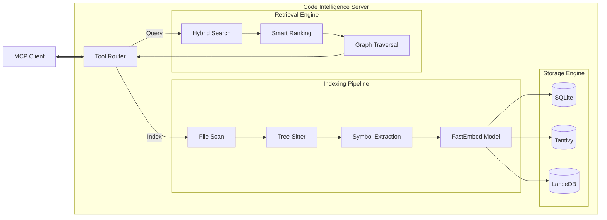

# Code Intelligence MCP Server

> **Semantic search and code navigation for LLM agents.**

[](https://www.npmjs.com/package/@iceinvein/code-intelligence-mcp)
[](LICENSE)
[](https://modelcontextprotocol.io)

---

This server indexes your codebase locally to provide **fast, semantic, and structure-aware** code navigation to tools like OpenCode, Trae, and Cursor.

## Why Use This Server?

Unlike basic text search, this server builds a local knowledge graph to understand your code.

* 🔍 **Hybrid Search V2**: Combines **Tantivy** (keyword) + **LanceDB** (semantic vector) + **FastEmbed** (local embedding model) with normalized scoring fusion.
* 🚀 **Production First**: Ranking heuristics prioritize implementation code over tests and glue code (`index.ts`).
* 🧠 **Developer Aware**: Handles common acronyms and casing (e.g., "db" matches "database" and "DBConnection").
* ⚡ **Fast & Local**: Written in **Rust**. Uses Metal GPU acceleration on macOS. Indexes are stored locally within your project.

---

## Quick Start

Runs directly via `npx` without requiring a local Rust toolchain.

### OpenCode / Trae

Add to your `opencode.json` (or global config):

```json
{
  "mcp": {
    "code-intelligence": {
      "type": "local",
      "command": ["npx", "-y", "@iceinvein/code-intelligence-mcp"],
      "enabled": true
    }
  }
}
```

*The server will automatically download the AI model (~300MB) and index your project in the background.*

---

## Capabilities

Available tools for the agent:

| Tool                       | Description                                                                                    |
| :------------------------- | :--------------------------------------------------------------------------------------------- |
| `search_code`              | **Primary Search.** Finds code by meaning ("how does auth work?") or structure ("class User"). |
| `get_definition`           | Retrieves the full definition of a specific symbol.                                            |
| `find_references`          | Finds all usages of a function, class, or variable.                                            |
| `get_call_hierarchy`       | specifices upstream callers and downstream callees.                                            |
| `get_type_graph`           | Explores inheritance (extends/implements) and type aliases.                                    |
| `explore_dependency_graph` | Explores module-level dependencies upstream or downstream.                                     |
| `get_file_symbols`         | Lists all symbols defined in a specific file.                                                  |
| `get_usage_examples`       | Returns real-world examples of how a symbol is used in the codebase.                           |
| `refresh_index`            | Manually triggers a re-index of the codebase.                                                  |

---

## Supported Languages

The server supports semantic navigation and symbol extraction for the following languages:

* **Rust**
* **TypeScript / TSX**
* **JavaScript**
* **Python**
* **Go**
* **Java**
* **C**
* **C++**

---

## Smart Ranking & Context Enhancement

The ranking engine optimizes results for relevance using sophisticated signals:

1. **Graph Popularity**: Symbols that are heavily referenced by other code receive a score boost, prioritizing "central" components.
2. **Directory Semantics**: Implementation directories (`src`, `lib`, `app`) are boosted, while build artifacts (`dist`, `build`) and `node_modules` are penalized.
3. **Test Penalty**: Test files (`*.test.ts`, `__tests__`) are ranked lower by default, but are boosted if the query intent implies testing.
4. **Glue Code Filtering**: Re-export files (e.g., `index.ts`) are deprioritized in favor of the actual implementation.
5. **Intent Detection**:
    * "struct User" → Boosts definitions.
    * "who calls login" → Triggers graph lookup.
    * "verify login" → Boosts test files.
    * "User schema" → Boosts files with "schema" or "model" in the path.

For a deep dive into the system's design, see [System Architecture](system_architecture.md).

---

## Configuration (Optional)

Works without configuration by default. You can customize behavior via environment variables:

```json
"env": {
  "WATCH_MODE": "true",          // Watch for file changes? (Default: false)
  "EMBEDDINGS_DEVICE": "cpu",    // Force CPU if Metal fails (Default: metal on mac)
  "INDEX_PATTERNS": "**/*.go",   // Add custom file types
  "MAX_CONTEXT_BYTES": "50000"   // Limit context window
}
```

---

## Architecture



---

## Development

1. **Prerequisites**: Rust (stable), `protobuf`.
2. **Build**: `cargo build --release`
3. **Run**: `./scripts/start_mcp.sh`
